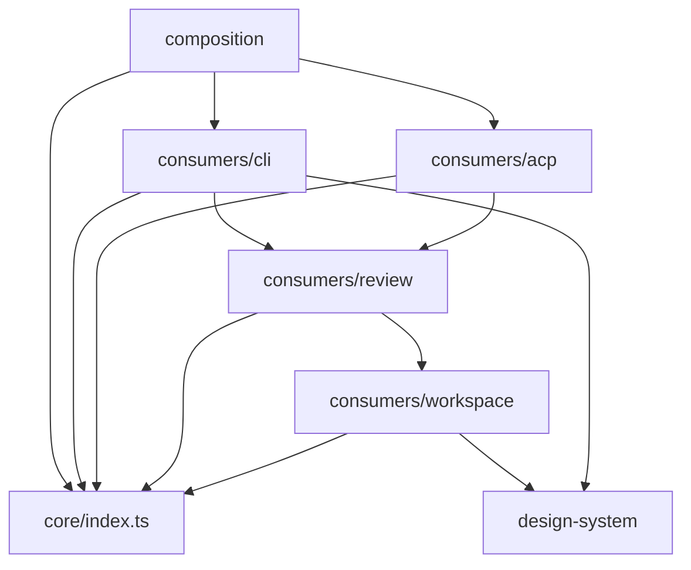
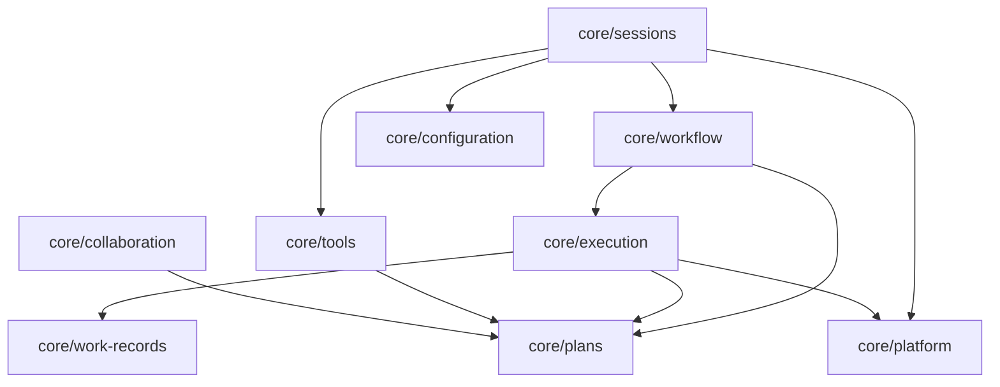

# Reorganize the Source Tree into Deep Semantic Modules

## Context

The live-session boundary is behaviorally clean. `SessionRuntime` owns live sessions and publishes semantic events, and
the TUI and ACP consume the public Runtime surface. The physical source tree does not communicate that architecture.

The main problem is `src/shared/` (43,250 production lines). It holds public application boundaries, private session
machinery, workflow orchestration, persistence, configuration, Git helpers, collaboration code, work records, and
unrelated utilities in one flat parent. `src/shared/session/` puts `SessionRuntime` beside `HostedSession`,
`SessionHost`, Pi construction, agent switching, prompt assembly, and persistence internals. A contributor browsing the
tree can reasonably mistake those files for peer APIs and import across a boundary that exists only in documentation and
tests.

The consumers have the same problem in reverse. TUI (`src/ui/tui/`), ACP (`src/acp/`), commands (`src/cmd/`), Workspace
(`src/ui/workspace/`), and browser review (`src/ui/review/`) sit at three different levels of the tree, so their shared
relationship to Core is invisible. `src/ui/` in particular groups a terminal renderer, a browser app, a browser design
system, and a review protocol under one name that describes none of them.

Folder placement does not replace dependency checks, but it is part of the architecture. The tree should make the
intended dependency direction obvious before a contributor reads `docs/architecture.md` or a boundary test.

### The design rule this Plan encodes

The user stated the rule that governs the decomposition:

> Module boundaries follow reasons-to-change; ports follow what leaves the process. Ports are a small subset. If the
> decomposition creates an interface per collaborator "for testability", that's the deps bag with nicer syntax.
>
> Use orthogonal architecture but with strict ports — only for what truly leaves RunWield, not for anything inside the
> machinery. Ports: Git, LLM API, Pi session management (the low-level one that writes JSONL files), etc.

Applied to this repository, the legitimate port list is short: Git, the agent turn, low-level Pi session and JSONL
writing, the browser, Mnemoteca, the GitHub CLI, the network, and subprocess exit. Plan writes, lifecycle transitions,
the worktree registry, locks, and workflow state are RunWield's own machinery and get no port.

Two existing constructs fail that test. `src/ui/tui/interactive-session-port.ts` wraps "start our own TUI", which never
leaves the process; it exists so commands can launch the TUI without importing it, and it disappears once
`src/composition/` owns wiring. `src/shared/workflow/validation-ports.ts` defines `ValidationSessionPort` with 16
members, of which roughly four are genuine boundaries (agent turns, isolated sessions, the in-memory session manager,
user interaction) and the rest are machinery: active workflow state, phase position memory, the progress panel, status
emission, agent display names, post-verification handoffs. That is the dependency bag with nicer syntax.

This Plan does **not** redesign `ValidationSessionPort`. Redesigning it changes validation behavior, and folding that
into a ~93,000-line move makes the diff unreviewable. Instead this Plan adds a ratchet that stops _new_ machinery ports
from appearing, and leaves the redesign to a follow-up Plan.

### Dependency on the Pi upgrade

`docs/plans/upgrade-pi-0-84-and-latex-rendering.md` is already `ready_for_work` and touches `deno.json` imports and TUI
rendering. It must land and be verified **before** this Plan starts execution. A tree-wide move rebases badly against a
pending dependency upgrade, and rerunning that upgrade against relocated TUI paths wastes the work twice. Two other
drafts overlap this tree — `split-and-convert-tui-chat-session.md` and `flag-test-seam-risks-during-init.md`, the latter
of which adds `src/shared/test-architecture/` and `src/cmd/check/`, two directories this Plan deletes. Neither should
start before this Plan completes; if either has already started, resolve the ordering before beginning here.

## Objective

Produce a source layout in which:

- `src/core/` is visibly the consumer-neutral RunWield engine;
- `src/consumers/` holds the surfaces that drive Core: the terminal (CLI entry, commands, TUI, terminal styling), ACP,
  browser review, and Workspace;
- `src/composition/` is the only place allowed to assemble Core with concrete consumers and process entrypoints;
- each semantic module has a small `index.ts` entrypoint and hides implementation files below its own directory;
- code outside `src/core/` imports Core only through `src/core/index.ts`;
- sibling Core modules import one another only through their module `index.ts` entrypoints;
- no module reaches into another module's `internal/` directory;
- old paths are deleted in the same change that updates their importers, with no compatibility re-export, forwarding
  module, duplicate implementation, or old/new path fallback;
- resource discovery, release compilation, tests, and documentation use the new canonical paths;
- TUI theme behavior stays unchanged; browser themes remain independent, dark by default, and easy to swap later.

## Non-goals

- Do not change Runtime behavior, Plan lifecycle behavior, routing policy, validation semantics, or TUI appearance
  merely because files move.
- Do not redesign `ValidationSessionPort` or any other existing port interface here.
- Do not split `src/plan-store.js` (3,656 lines). Move it whole; split it in a later, reviewable change.
- Do not perform a wholesale JavaScript-to-TypeScript rewrite. Per current repository policy, new files are TypeScript
  and small opportunistic conversions are fine at any time, but large rewrites are explicit separate work. Moved files
  keep their current extension unless a specific step in this Plan says otherwise.
- Do not create a generic `common/`, `shared/`, `utils/`, or `misc/` replacement. A module must have a domain name.
- Do not retain the old tree to make the migration incremental at runtime. Git history is the migration record.
- Do not create package-level abstractions with a single caller unless they establish a real ownership boundary.

## Approach

Move by module, not by file. Each module move is atomic: relocate the implementation and its colocated tests, update
every importer and resource path, delete the old path, then run the boundary scan and the affected suites before
starting the next module. Nothing is left at an old path.

Two code edits and one theme-preservation step accompany the moves. Each is small, bounded, and named below:

1. **Split `src/ui/theme/theme.js`** into the theme-JSON contract (Core) and terminal chalk styling (CLI consumer).
2. **Extract `sharePlanForReview`** out of `src/cmd/plans/share.ts` into Core collaboration, so ACP stops importing a
   CLI command.
3. **Preserve independent browser themes.** The old loader is already removed. Move the browser theme modules and pure
   renderer together without restoring TUI settings coupling.

Everything else is a move plus import rewrites.

## Target directory structure

```text
src/
  core/                       consumer-neutral engine; imports nothing above it
    index.ts                  the only Core import path used outside core/
    architecture-boundary.test.ts

    sessions/                 ← src/shared/session/
      index.ts                SessionRuntime, events, interactions, snapshots
      internal/               hosted-session, session-host, early-steering, transcript-projection
        agent-runtime/        session.js split by responsibility, agent-handler, agent-switching,
                              agent-assets, subagent-definitions, model-selection,
                              SYSTEM_PROMPT_TEMPLATE.md
        backends/             execution-backend.ts, claude-cli/
        persistence/          root-session, session-catalog, workflow-context
        attachments/          image-attachments

    workflow/                 orchestrator, decisions, routing ceremonies, workflow-prompts,
                              workflow-slicer, planning-agent, state-transition, workflow-results

    execution/                plan-executor, execution-start/context/collaboration, engineer-runner,
                              implementation-checkpoint, git-snapshot, metrics, epic-continuation
      validation/             the decomposed validation engine and phase modules,
                              including validation-ports.ts
      worktrees/              ← src/shared/worktree*.js  (worktree, registry, merge, recovery)

    plans/                    ← src/plan-store.js (moved whole), src/plan-front-matter.js,
                              plan-lifecycle, plan-approval, plan-review-recovery,
                              ticket-references, execution-plan-file, yaml-scalar.ts

    work-records/             ← src/shared/work-records/  (keeps mnemoteca-port.ts — a real port)

    collaboration/            ← src/shared/collaboration/
      share-plan.ts           ← the non-CLI half of src/cmd/plans/share.ts
      owner-coordination/     ← src/shared/owner-coordination/

    configuration/            settings, models/, agent catalogs, package-resources, domain-language,
                              prompt/skill/context discovery, wld-extension-manifest
      themes/                 ← theme-discovery.ts, theme-json policy, catppuccin-mocha.json,
                              DEFAULT_THEME_NAME/JSON, resolveAvailableThemeJsons,
                              resolveSelectedThemeJson  — terminal theme-selection policy

    tools/                    ← src/tools/  (registry, policy, definitions/)

    platform/                 git.js + git-port.ts, project-state, runtime-preflight, process-liveness,
                              foreground-process, snip-filters, update-check, browser-port,
                              helpers.js (directoryExists/fileExists)
      paths/                  ← src/constants.js  (getCwd, getHomeDir, bundled asset paths)

  consumers/
    cli/                      the terminal surface
      main.ts                 ← src/cli.ts, including the standalone `createRequire` bootstrap
      commands/               ← src/cmd/  (33 command directories + registry.js)
      tui/                    ← src/ui/tui/
      style/                  ← the chalk half of src/ui/theme/theme.js + theme-registry.js
    acp/                      ← src/acp/
    review/                   ← src/ui/review/  (plan-review, code-review, review-launcher)
    workspace/                ← src/ui/workspace/  (Astro/React app + server/)

  design-system/              ← src/ui/design-system/  (browser themes, pure CSS renderer, primitives)
  extensions/                 unchanged name and location (cymbal, mnemoteca, re-anchor, snip)
  composition/                port wiring currently inline in src/cmd/registry.js
  resources/                  ← src/agent-definitions/, src/prompt-templates/, src/skills/,
                              src/snip-filters/
  testing/                    unchanged (process-global-lock, home sandbox helpers)
```

Leaf filenames may change during implementation when an existing file is split, but ownership and allowed dependency
direction must not change without updating this Plan and `docs/architecture.md` first.

### Why these placements

- **`consumers/cli/` contains commands, TUI, and terminal style.** `src/cmd/` is not CLI-only today — the TUI imports
  `commandRegistry`, `getSlashCommandDefinitions`, and `COMMAND_NAMES` from it (`src/ui/tui/chat-session.js:42,50`,
  `src/ui/tui/model-welcome.ts:11`, `src/ui/tui/boot-banner.ts:4`). That objection only holds while the TUI is a
  separate top-level consumer. The terminal entry, the command registry, and the TUI share a registry and change
  together, so by the reasons-to-change rule they are one module, and those imports become module-internal.
- **`design-system/` is top-level, not under `consumers/`.** It already owns independent browser theme sets and a pure
  CSS renderer with no Core or consumer imports. Move them together with fonts and primitives. A pure leaf belongs
  beside the consumers, not inside one. Update `docs/design-system.md` to point at the new path.
- **`extensions/` keeps its name.** "Integrations" is fuzzier than what the folder holds.
- **`src/review-workspace-server.js` is deleted, not moved.** It is a 14-line pure forwarder, exactly the shape this
  Plan forbids.

## Module relationships

Core imports nothing above it. `composition/` imports everything and is imported by nothing. Among consumers there is
one declared direction — the terminal may reach browser surfaces, never the reverse.



Core-internal direction:



Forbidden relationships:

- Core → any consumer, `design-system/`, `extensions/`, or `composition/`.
- Anything outside Core → `src/core/**` except `src/core/index.ts`.
- One Core submodule → another Core submodule's leaf file or `internal/` directory.
- `design-system/` → anything outside itself.
- Workspace or review → `consumers/cli/` (including its TUI and commands).
- ACP → `consumers/cli/`.
- Command definitions → Hosted Session, Pi session, Runtime event publisher, or transcript manager internals.
- Any new `shared/`, `common/`, `misc/`, or catch-all `utils/` directory.

## Files to Modify

Whole-directory moves:

- `src/shared/session/` → `src/core/sessions/` — `SessionRuntime`, events, interactions, and snapshots become the public
  face; everything else drops into `internal/` subdomains.
- `src/shared/workflow/` (98 files) → split between `src/core/workflow/` (orchestration, routing, decisions, prompts,
  slicing, state transitions) and `src/core/execution/` (plan execution, validation, checkpoints, metrics).
- `src/shared/worktree*.js`, `worktree-registry.js`, `worktree-test-helpers.js` → `src/core/execution/worktrees/`.
- `src/shared/collaboration/` → `src/core/collaboration/`; `src/shared/owner-coordination/` →
  `src/core/collaboration/owner-coordination/`.
- `src/shared/work-records/` → `src/core/work-records/`.
- `src/shared/models/` → `src/core/configuration/models/`; `src/shared/extensions/wld-extension-manifest.js` →
  `src/core/configuration/`.
- `src/tools/` → `src/core/tools/`.
- `src/ui/tui/` → `src/consumers/cli/tui/`; `src/cmd/` → `src/consumers/cli/commands/`; `src/acp/` →
  `src/consumers/acp/`; `src/ui/review/` → `src/consumers/review/`; `src/ui/workspace/` → `src/consumers/workspace/`;
  `src/ui/design-system/` → `src/design-system/`.
- `src/agent-definitions/`, `src/prompt-templates/`, `src/skills/`, `src/snip-filters/` → `src/resources/`.

Individual files that need a decision rather than a bulk move:

- `src/cli.ts` → `src/consumers/cli/main.ts`. The `createRequire` bootstrap at line 21 moves with it.
- `src/constants.js` → `src/core/platform/paths/`. `getCwd`/`getHomeDir` are an ownership boundary over process globals
  already enforced by a custom lint rule, so they get a named owner instead of a root file.
- `src/plan-store.js` → `src/core/plans/plan-store.js`, moved whole. `src/plan-front-matter.js` and
  `src/shared/yaml-scalar.ts` follow it.
- `src/shared/helpers.js` → `src/core/platform/`. It exports only `directoryExists` and `fileExists`.
- `src/shared/types.js` → the JSDoc typedefs move to the modules that own each shape (`SessionSnapshot` and
  `SessionRuntimeEventSink` to `core/sessions/`, `ProjectContext` to `core/configuration/`). The file does not survive
  as a shared type dump.
- `src/shared/version.js` is generated by `scripts/write-version.js` and is the sole entry in the language-policy
  exclusion list. Move it to `src/core/platform/version.js` and update both the generator and the exclusion path.
- `src/review-workspace-server.js` — **deleted**, callers point at the Workspace server directly.
- `src/ui/tui/interactive-session-port.ts` — removed. `src/cmd/registry.js:43` imports `SYSTEM_INTERACTIVE_SESSION_PORT`
  from the TUI today; once `src/composition/` wires the terminal application, the command registry no longer needs a
  port to launch its own TUI.

Configuration, scripts, and documentation:

- `deno.json` — every task path changes: `cli`, `test:golden-tui`, `workspace:dev`, `workspace:build`,
  `workspace:check`, `workspace:remote`, `workspace:test`, and `compile:watch` all name `src/cli.ts`,
  `src/ui/workspace/…`, `src/ui/tui/…`, or `src/shared/version.js`.
- `scripts/compile.js` — entry path and `--include` resource arguments.
- `scripts/language-policy-baseline.json` — 210 literal `src/**` paths, every one of which changes.
- `scripts/write-version.js`, `scripts/check-doc-links.js`, `scripts/build-workspace-runtime.js`,
  `scripts/build-plan-server-runtime.js`, `scripts/assert-workspace-review-runtime.js`,
  `scripts/assert-plan-server-image.js`, `scripts/run-prototype.js`, and `scripts/lint-rules/` — all reference source
  paths.
- `.vscode/launch.json` and `.githooks/` if they name `src/cli.ts`.
- `docs/architecture.md` (76KB) — rewrite the source guide and dependency diagrams to match the final tree.
- `docs/design-system.md` — repoint at `src/design-system/`, preserving browser-owned theme sets and their independence
  from terminal theme selection in `src/core/configuration/themes/`.
- `docs/contributing.md`, `docs/acp-implementation-details.md`, `docs/plan-lifecycle.md`, `docs/domain-language.md`, and
  `CLAUDE.md` — every `src/shared|src/ui|src/cmd|src/acp|src/tools` reference.

`docs/domain-language.md` needs only its embedded source paths corrected. This Plan introduces no product-facing domain
terms: Core, consumer, and composition are architecture vocabulary and belong in `docs/architecture.md`, not the product
glossary.

## The two code edits and theme-preservation step

### 1. Split `src/ui/theme/theme.js` (240 lines)

Separate terminal theme-selection policy from terminal chalk styling; browser themes do not consume either half.

**To `src/core/configuration/themes/`** — terminal theme-selection policy:

- `DEFAULT_THEME_NAME`, `DEFAULT_THEME_JSON`, `resolveAvailableThemeJsons`, `resolveSelectedThemeJson`;
- `theme-discovery.ts` (`loadExternalThemeJsons`);
- the JSON policy half of `theme-json.js`: the `ThemeJson` typedef, `mergeThemeJson`, `resolveThemeVars`;
- `catppuccin-mocha.json`.

**To `src/consumers/cli/style/`** — terminal chalk styling, which never leaves the terminal:

- the `theme` proxy, `getMarkdownTheme`, `getSelectListTheme`, `getEditorTheme`, `imageTheme`;
- `initRunWieldTheme`, `applyPersistedTheme`, `discoverAndRegisterThemes`, `setTheme`, `setThemeInstance`,
  `setRegisteredThemes`, `getAvailableThemes`, `onThemeChange`;
- `theme-registry.js`;
- the Pi-`Theme` construction half of `theme-json.js`: `createThemeFromJson`, `detectColorMode`, `splitFgBgColors`,
  `BG_TOKEN_NAMES`.

**The carryover invariant this must preserve.** The persisted theme name controls only terminal appearance. Preserve
`applyPersistedTheme()`, discovery, and partial-theme merge behavior through the move. Browser surfaces instead use
`DARK_BROWSER_THEME` and the pure browser renderer, regardless of OS or TUI settings. Keep alternate browser token sets
swappable without changing component CSS. Regression tests must protect both terminal behavior and browser independence.

The browser route no longer uses a `Deno eval` theme lookup, and the design system no longer dynamically imports the
terminal theme module. Do not restore either dependency.

### 2. Extract `sharePlanForReview` from `src/cmd/plans/share.ts` (441 lines)

`src/acp/interaction-mapper.js:12` imports `sharePlanForReview` from `src/cmd/plans/share.ts`. That is the one
cross-consumer edge the new structure does not absorb, and it fails the boundary check on day one.

The split is clean because the file already has one:

- **Stays in `src/consumers/cli/commands/plans/share.ts`** — `parsePlansShareArgs`, `printShareHelp`,
  `runPlansShareCommand`, and the console output. Roughly 90 lines of argument parsing and presentation.
- **Moves to `src/core/collaboration/share-plan.ts`** — `sharePlanForReview`, `resolveActivePlan`,
  `resolvePlanServerUrl`, `secretRecordKey`, `assertNoConflictingSecretRecord`, `cleanupRemoteSpace`,
  `normalizeCreateResponse`, and the `SharePlanForReviewOptions` / `SharedPlanReviewLink` interfaces. It already imports
  only Core: the Plan store, `shared/collaboration/*`, and settings.

`src/cmd/plans/collaboration-commands.integration.test.ts` exercises both halves and splits the same way: the
`sharePlanForReview` cases follow the operation into Core; the argument-parsing cases stay with the command.

### 3. Preserve independent browser themes

`loadRunWieldThemeCss` and the unused Workspace `server/theme-css.js` compatibility module are already removed. Do not
recreate or relocate them. Move `themes/dark.ts`, `theme-bridge.js`, `tokens.css`, `fonts.css`, and bundled fonts with
the design system. `DARK_BROWSER_THEME` keeps its `name`, `colorScheme`, and semantic `colors` shape.

`renderRunWieldThemeCss(theme = DARK_BROWSER_THEME)` stays a pure browser renderer with review aliases. Both browser
`/theme.css` endpoints keep calling it without arguments. Preserve separate color sets for future light/custom themes;
geometry, typography, and derived Complexity intent stay in `tokens.css`. This move adds no theme picker, light theme,
or TUI appearance change. Follow
[Workspace appearance requirements](../prd/runwield-workspace-prd.md#browser-appearance-and-themes).

## Reuse Opportunities

- `src/shared/workflow/` is already decomposed into 55 modules behind a 124-line `validation.ts` composition root. Move
  those modules as a unit; do not re-split them.
- `scripts/check-injection-seams.js` and `scripts/check-language-policy.js` are the working model for the new boundary
  ratchet: walk the source tree, compare against a committed baseline, fail CI on drift, and offer `--update`. Build the
  port allowlist the same way rather than inventing a new checker shape.
- `src/shared/git-test-fixture.ts` (`defineGitFixture`) and `makeValidationProjectRoot` remain the way to fake the
  environment in tests. This Plan adds no injection seams.
- Both browser theme endpoints already call `renderRunWieldThemeCss()` with the browser-owned default. Preserve that
  shape and the renderer's alternate-theme argument through the move.

## Implementation Steps

### Phase 1 — Boundary enforcement exists before any code moves

- [ ] `src/core/architecture-boundary.test.ts` exists and its analyzer parses import specifiers rather than matching
      free text. Given a synthetic file path and import specifier, it reports a violation for each forbidden
      relationship listed under **Module relationships**, and the test asserts those synthetic cases directly, so the
      test fails if the analyzer stops detecting any one of them.
- [ ] `scripts/check-port-allowlist.js` exists, is registered as `deno task ports:check`, runs inside `deno task ci`,
      and fails when a file matching `*-port.ts` or a type name ending in `Port` appears outside a committed allowlist.
      The initial allowlist contains exactly today's ports: `git-port.ts`, `browser-port.ts`, `mnemoteca-port.ts`,
      `execution-backend.ts`, `validation-ports.ts`, and the GitHub CLI, update-network, and process-exit ports composed
      in the command registry. `interactive-session-port.ts` is deliberately absent because Phase 5 removes it.
- [ ] `docs/architecture.md` describes the target tree, the allowed dependency graph, the forbidden relationships, and
      the port rule, before any import is rewritten.

### Phase 2 — Session engine

- [ ] `src/core/sessions/index.ts` exports `SessionRuntime`, Runtime event constants, interaction contracts, and
      immutable session snapshots, and exports none of `HostedSession`, `SessionHost`, Pi `AgentSession`, Pi
      `SessionManager`, root-session persistence objects, agent handlers, or event publishers.
- [ ] `src/shared/session/session.js` no longer exists; its responsibilities live in separate files under
      `src/core/sessions/internal/agent-runtime/` divided by construction, prompt and model assembly, and event
      bridging. No single file in that directory is a renamed copy of the original.
- [ ] `src/shared/session/` does not exist, and no file at any former path re-exports from `src/core/sessions/`.

### Phase 3 — Workflow, Plans, execution

- [ ] `src/core/workflow/`, `src/core/execution/`, `src/core/execution/validation/`, `src/core/execution/worktrees/`,
      and `src/core/plans/` each own their modules and each expose an `index.ts`.
- [ ] `src/core/plans/plan-store.js` is the moved 3,656-line file with its exports unchanged; `src/plan-store.js` does
      not exist.
- [ ] `src/core/workflow/` and `src/core/execution/` reach Plan operations only through `src/core/plans/index.ts`, and
      no file in either imports a `src/core/plans/` leaf path.
- [ ] `src/shared/workflow/` and the root worktree helpers do not exist.

### Phase 4 — Configuration, tools, collaboration, platform, work records

- [ ] `src/core/configuration/`, `src/core/tools/`, `src/core/collaboration/`, `src/core/work-records/`, and
      `src/core/platform/` own their modules, each behind an `index.ts`.
- [ ] `src/core/configuration/themes/` owns `DEFAULT_THEME_NAME`, `DEFAULT_THEME_JSON`, `resolveAvailableThemeJsons`,
      `resolveSelectedThemeJson`, `loadExternalThemeJsons`, `mergeThemeJson`, `resolveThemeVars`, and
      `catppuccin-mocha.json`. It does not import `@earendil-works/pi-coding-agent`'s `Theme` class and does not export
      any chalk-styling function.
- [ ] `src/core/platform/paths/` owns `getCwd`, `getHomeDir`, and the bundled asset path constants; `src/constants.js`
      does not exist and the custom lint rule that forbids direct `Deno.env.get("HOME")` and `Deno.cwd()` reads in
      `src/` still passes.
- [ ] `src/core/collaboration/share-plan.ts` owns `sharePlanForReview` and its helpers; that function is no longer
      declared in any file under `src/consumers/`.
- [ ] `src/shared/` does not exist. No file was placed in a catch-all module to make this true.

### Phase 5 — Consumers

- [ ] `src/consumers/cli/main.ts`, `src/consumers/cli/commands/`, `src/consumers/cli/tui/`, and
      `src/consumers/cli/style/` exist and hold the moved terminal surface. `src/cli.ts`, `src/cmd/`, and `src/ui/tui/`
      do not exist.
- [ ] `src/consumers/cli/style/` owns the `theme` proxy, `getMarkdownTheme`, `getSelectListTheme`, `getEditorTheme`,
      `imageTheme`, `initRunWieldTheme`, `applyPersistedTheme`, `discoverAndRegisterThemes`, `setTheme`,
      `setThemeInstance`, `setRegisteredThemes`, `getAvailableThemes`, `onThemeChange`, `createThemeFromJson`,
      `detectColorMode`, and `splitFgBgColors`. None of those names is exported from `src/core/`.
- [ ] `src/consumers/acp/interaction-mapper.js` imports `sharePlanForReview` from Core and contains no import specifier
      naming `commands/plans/share`.
- [ ] `src/consumers/review/` and `src/consumers/workspace/` exist; `src/ui/review/`, `src/ui/workspace/`, and
      `src/review-workspace-server.js` do not.
- [ ] `src/design-system/` exists and every import specifier in it resolves inside `src/design-system/` or to an npm/JSR
      dependency — none names `src/core/`, `src/consumers/`, or terminal theme modules. Browser theme modules remain
      inside the design system; both endpoints use its pure renderer. `loadRunWieldThemeCss` and the removed Workspace
      `server/theme-css.js` module stay absent. Future light/custom token sets require no component restyle.
- [ ] `interactive-session-port.ts` does not exist anywhere in `src/`, and `SYSTEM_INTERACTIVE_SESSION_PORT` appears in
      no file.

### Phase 6 — Composition, resources, tooling

- [ ] `src/composition/` owns the executable assembly for the terminal application and the ACP server, including the
      port wiring currently inline in `src/cmd/registry.js:43`. No file under `src/consumers/` constructs a `SYSTEM_*`
      port for another consumer.
- [ ] `src/resources/` holds the moved `agent-definitions/`, `prompt-templates/`, `skills/`, and `snip-filters/`, and
      every `import.meta.url` resolution and Deno compile `--include` argument names the new locations.
- [ ] `deno.json` contains no task whose path names `src/cli.ts`, `src/ui/`, `src/cmd/`, `src/acp/`, `src/tools/`, or
      `src/shared/`.
- [ ] `scripts/language-policy-baseline.json` contains the same number of entries as before the move (210) with every
      path rewritten to its new location, and `deno task language-policy:check` passes without `--update` needing to add
      an entry.
- [ ] `docs/architecture.md`, `docs/design-system.md`, `docs/contributing.md`, `docs/acp-implementation-details.md`,
      `docs/plan-lifecycle.md`, `docs/domain-language.md`, and `CLAUDE.md` name only new paths, and
      `deno task doc-links:check` passes.

## Verification Plan

**Automated**

```sh
deno task check
deno task lint
deno fmt --check
deno task language-policy:check
deno task seams:check
deno task ports:check
deno task doc-links:check
deno run -A scripts/run-tests.js -A --no-check src/core/architecture-boundary.test.ts
deno task test
deno task ci
deno task compile && ./bin/wld --version
deno task release:check
```

`deno task compile` followed by running the binary is not optional. The `createRequire` bootstrap that moves into
`src/consumers/cli/main.ts` only matters in the compiled standalone binary; ES imports are hoisted, so every static
import in that file evaluates before the bootstrap line runs. If any npm dependency reads `globalThis.require` during
module evaluation rather than at call time, the binary breaks and the source-run path never shows it.

**Manual**

- Run `wld` from a project and switch TUI themes, including a light theme. Confirm terminal selection still works; Plan
  Review, Code Review, and Workspace retain the approved dark browser identity, even with light OS settings.
- Run `deno task workspace:dev` and load `/theme.css`; compare the production endpoint. Both return the browser-owned
  default, without terminal settings lookup. Confirm no browser theme picker or light-mode action appears.
- Supply an alternate semantic token set to the renderer in a test. Confirm its colors and review aliases change while
  component CSS, geometry, and typography stay unchanged. This verifies future swapping, not a shipped light theme.
- Run `wld plans share <plan>` and confirm the reviewer and maintainer URLs print once, then confirm the ACP share path
  still returns a link.
- Start an ACP session and a TUI session against the same project and confirm both receive identical Runtime events.

**Which behavior must still be protected**

Every existing test is expected to survive this Plan. Nothing here removes a feature, so a test that no longer compiles
must be rewritten against the new path or the new module shape — never deleted. Three areas need explicit care:

- `src/ui/theme/theme-json.test.js` and `theme-registry.test.js` split along with their subjects. The JSON-policy cases
  (`mergeThemeJson`, `resolveThemeVars`) follow Core; the Pi-`Theme` construction cases (`createThemeFromJson`,
  `splitFgBgColors`, `detectColorMode`) follow `consumers/cli/style/`. No case is dropped.
- `src/cmd/plans/collaboration-commands.integration.test.ts` splits between the Core operation and the command. The
  `sharePlanForReview` cases — reuse of an already-shared Plan, archived-Plan rejection, stale remote handling, secret
  cleanup on failure — must keep running against the real operation in Core.
- Preserve the design-system, theme-bridge, Workspace theme, and board tests with their owning modules. Protect the
  renderer's dark default, alternate token sets, and review aliases, plus both browser endpoints' independence from
  terminal settings. Keep compact-workbench assertions intact.

**Behavior expected to stop existing:** only `SYSTEM_INTERACTIVE_SESSION_PORT` and the `InteractiveSessionPort`
interface. Tests that exist solely to exercise that indirection are removed; tests that exercise _launching the TUI from
a command_ must be rewritten against the composition root instead.

## Edge Cases & Considerations

| Risk                                                                      | Mitigation                                                                                                                                                                                                                                   |
| ------------------------------------------------------------------------- | -------------------------------------------------------------------------------------------------------------------------------------------------------------------------------------------------------------------------------------------- |
| A tree-wide move rebases badly against three queued Plans                 | `upgrade-pi-0-84-and-latex-rendering` lands and is verified first; `split-and-convert-tui-chat-session` and `flag-test-seam-risks-during-init` do not start until this Plan completes.                                                       |
| Literal source paths survive type-checking                                | Compile `--include` arguments, `import.meta.url` resolution, and bundled browser font URLs need runtime checks. Run the compiled-binary smoke test and verify Workspace theme and font loading; the old `Deno eval` theme lookup is removed. |
| The standalone `createRequire` bootstrap breaks only in the binary        | `deno task compile && ./bin/wld --version` runs as a required verification step, not a spot check.                                                                                                                                           |
| Regenerating the language-policy baseline silently blesses new JavaScript | The entry count must stay at 210 and every change must be a path rewrite. `--update` adding an entry is a failure, not a fix.                                                                                                                |
| A broad `src/core/index.ts` becomes a new grab bag                        | It exports only documented application surfaces, with an explicit export-allowlist assertion in the boundary test.                                                                                                                           |
| `src/consumers/cli/commands/` becomes hidden Core logic                   | Commands parse, present, and dispatch. Durable session and workflow state stays behind Core APIs, enforced by the boundary test.                                                                                                             |
| The move reconnects browser colors to terminal settings                   | Verify unchanged terminal theme selection, dark browser defaults despite OS/TUI light settings, and alternate browser token sets without component restyling.                                                                                |
| Old paths return later as "temporary" compatibility                       | OC1 plus the boundary test's re-export rule. No forwarding module is acceptable at any point, including mid-migration.                                                                                                                       |
| `src/shared/types.js` typedefs have no obvious owner                      | Each typedef moves to the module that owns the shape. If one genuinely has no owner, stop and name the module rather than creating a type dump.                                                                                              |

**Open assumptions**

- The working tree currently has uncommitted changes to `deno.json`, `install.sh`, `scripts/`, and Snip filters, plus an
  untracked `scripts/run-with-snip.ts`. Those must be committed or stashed before execution begins; a 600-file move on
  top of uncommitted edits is not recoverable by `git checkout`.
- `ValidationSessionPort` keeps all 16 members and moves unchanged into `src/core/execution/validation/`. The port
  allowlist admits it as pre-existing. Its redesign is a separate follow-up Plan.
- `src/composition/` is expected to hold two entry assemblies (terminal and ACP). If a third genuinely distinct
  entrypoint appears during Phase 6, add it rather than forcing it through one of the two.

[Mnemoteca]: https://github.com/gandazgul/mnemoteca
