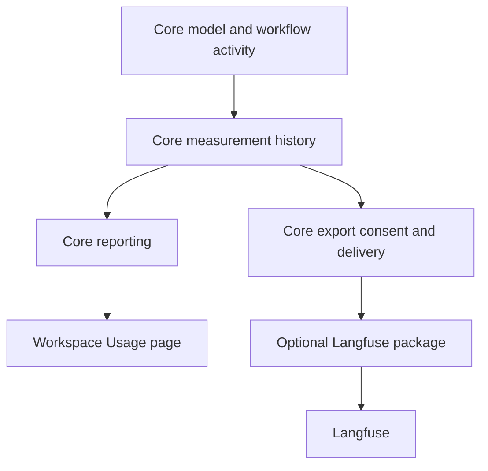
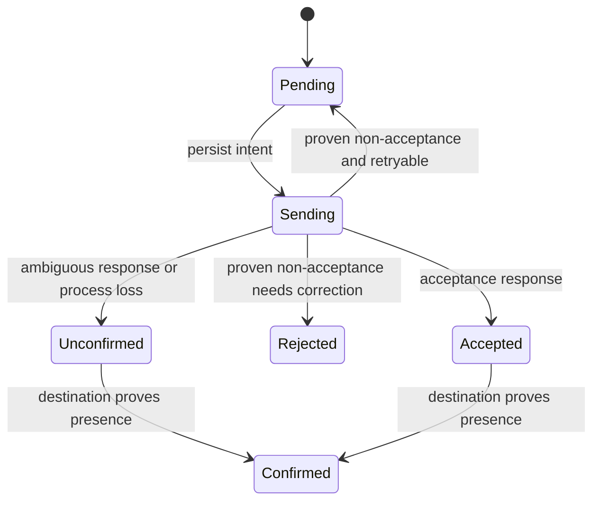

# Reliable Usage, Workspace Dashboard, and Langfuse Export

## Context

The owner wants to understand their own RunWield usage and its workflow outcomes. Existing local metrics are incomplete
and have no reporting surface. This Epic adds reliable local measurement, a modest Personal Workspace dashboard, and an
optional Langfuse export plugin. It does not build a developer productivity score or a general analytics platform.

### Agreed product scope

- One developer across Projects on one RunWield host. No team aggregation or multi-host collection service.
- Pi, Claude CLI, and Antigravity CLI. Include ordinary Sessions and RunWield-started auxiliary model calls, not only
  planned implementation. Coverage does not promise identical upstream detail.
- Link available measurements to Sessions, Plans, validation, repair, and confirmed publication. Do not invent links.
- Local measurement is **on by default**. Preserve explicit user opt-outs. This changes the current opt-in default.
- Show metrics that were actually collected, including understood legacy records. Never mine old transcripts to create
  historical metrics. Disabled periods remain gaps after re-enabling.
- Keep local measurements until the user deletes them. No automatic age-based expiry.
- Export is separately opt-in, starts with new measurements only, and runs automatically while TUI or the owner
  Workspace process runs. Pending work waits when neither process runs; no new daemon.
- Langfuse is the first optional destination. Plugins consume Core measurements; they do not collect them.
- Do not export prompts, code, conversation text, raw tool data, or private file paths.
- Retry known non-acceptance. Never automatically resend an ambiguous Langfuse delivery. The owner accepts possible
  remote gaps rather than inflated counts. Local reporting remains independent of remote delivery.
- Jellyfish, other destination implementations, gateway governance, team analytics, and external-host model accounting
  through RunWield Connect are out of scope. Core use through ACP remains ordinary Core measurement.

This is target architecture, not delivered capability. No independent PRD was written in this discussion. The living
PRDs below own the lasting requirements; their delivering changes must add the proposed capabilities and scenarios.

### Product ownership and proposed changes

| Owner                                                                                                      | Current behavior to preserve                                            | Proposed addition or change                                                                                                                                                    |
| ---------------------------------------------------------------------------------------------------------- | ----------------------------------------------------------------------- | ------------------------------------------------------------------------------------------------------------------------------------------------------------------------------ |
| [Core: models and providers](../prd/runwield-core-prd.md#models-and-providers)                             | Backend selection and honest visibility limits                          | New **Usage measurement and export** capability owns local recording, meanings, gaps, retention, consent and export. Reference backend limitations rather than duplicate them. |
| [Core: execution, validation, and recovery](../prd/runwield-core-prd.md#execution-validation-and-recovery) | Only confirmed publication or deliberate abandonment concludes delivery | Measurements report existing outcomes, never create a third conclusion.                                                                                                        |
| [Core: Agent and skill customization](../prd/runwield-core-prd.md#agent-and-skill-customization)           | Optional installed integrations and user control                        | Document a narrow, separately approved metrics-exporter kind.                                                                                                                  |
| [Workspace: Project access and navigation](../prd/runwield-workspace-prd.md#project-access-and-navigation) | Only registered, enabled Projects are accessible                        | New **Personal usage and outcomes** capability owns the browser report and controls. It references Core measurement rules.                                                     |
| [Workspace: attention dashboard](../prd/runwield-workspace-prd.md#attention-dashboard)                     | Home helps the owner find the next action                               | Add a separate Usage destination; do not replace home or Session navigation.                                                                                                   |
| [Root: consistent workflow outcomes](../prd/runwield.md#consistent-workflow-outcomes-across-surfaces)      | Shared Core behavior across clients                                     | Update the capability ownership map and links, not a second measurement specification.                                                                                         |

The two new capability headings above are proposed, not existing links. The acceptance scenarios in Outcome Evidence
belong under those owners when delivered. Shared behavior keeps one PRD owner.

[Earlier feasibility research](../research/metrics-export-and-ai-impact.md) and
[destination research](../research/ai-metrics-and-governance-integrations.md) provide context, not a live integration
claim. The earlier Pi-only PoC and Jellyfish-only destination are superseded by this scope.

## Objective

Use one Core-owned measurement history and one set of reporting rules for Workspace and optional export. Keep Session,
Plan, and publication authority where they are today.



Arrows show data flow. Workspace and the exporter never calculate competing source totals or mutate workflow facts. No
exporter is required for local collection or reporting. No Workspace database is required for Core measurement.

### Module responsibilities and contracts

**Measurement module — Core-owned.** A cohesive capability below the Session and workflow callers owns observation
identity, enablement, safe fields, durable history, reporting, and coverage. Its collection interface accepts structured
facts, not transcript/runtime payloads. Callers provide the known operation identity, parent context, timestamps, source
and numeric evidence. They do not choose persistence, retry writes, calculate dashboard totals, or sanitize arbitrary
objects. The module reports persistence success truthfully; failures do not stop model or delivery work.

**Execution adapters — existing owners.** Pi and CLI adapters translate their actual usage semantics before information
is lost to zero defaults. They identify whether a value describes an individual request or a cumulative CLI turn. Core
also observes delegation, AI review, compaction, vision fallback, Guided Review and other RunWield-started model calls.
The measurement module is not a replaceable test seam. Subprocesses and vendor network calls remain real external
boundaries.

**Reporting — inside the measurement module.** Queries accept an authorized set of Project identities, a period, and
reporting time zone. Results contain settled totals, coverage and exclusion counts, daily buckets, backend/model
breakdowns, and links represented by stable local identifiers. Aggregation reads collected measurements only. It cannot
construct a writable Session manager, scan transcripts for usage, contact a model, or infer success from Plan status.

**Export coordination — Core-owned.** Core owns approved destinations and Projects, export start boundaries, safe record
construction, pending delivery, attempt state, retries, shutdown and status. It calls an approved exporter with one
immutable observation and a deadline. Exporter results distinguish accepted, known non-acceptance, and uncertain
acceptance; transient/permanent errors are classified only when supported by the external contract. Optional read-back
can confirm presence. Plugin code does not receive the journal, a Session object, Plan contents, or write authority.

**Metrics exporter — optional package.** The genuine variation is the external destination's authentication, mapping,
transport and acceptance semantics. The Langfuse implementation owns those details. Another destination can implement
that same narrow contract later without changing collection callers. There is no general event-bus or agent-extension
framework in this Epic.

### Recorded facts and meanings

The versioned contract records stable observation and operation IDs, parent operation where known, canonical Project
identity, optional Session/segment/Plan/attempt IDs, source kind, backend/model identifiers, occurrence time, completion
state, non-overlapping token categories, and cost evidence. Tool observations retain tool identity, duration and bounded
outcome codes, never arguments/results. Workflow observations retain the committed transition or confirmed delivery
identity, not free-form error messages. Known commit links can remain local; they are not required in the first export.

Use named shapes and explicit field availability. Each numeric value is reported, estimated, unavailable, or incomplete
as applicable. Cost includes its source and price basis; provider/CLI estimates remain estimates. Missing cost is never
silently treated as a measured zero. A supplied zero is only measured zero when the source establishes that meaning.
Current CLI versions must be checked with fixtures and authorized live output; source omission is not upstream proof.

A model invocation gets an identity before use. Retries get distinct attempt identities; persistence retries reuse their
record identity. Repeated streaming chunks and final cumulative totals cannot both contribute. A parent summary never
adds its children's usage again. Where only a CLI turn total exists, record that granularity rather than fabricate
individual calls. Incomplete token categories produce a known subtotal with exclusions, not a complete total.

Plan attribution is optional and time-scoped. One Session may touch multiple Plans. General discussion stays unassigned;
it is not allocated to every associated Plan. Tool fan-out is not model-request fan-out. Native CLI tool updates count
as calls only when stable identity and event meanings are verified; otherwise mark that coverage unavailable.

**Reporting rules:** active days are days with an accepted human request or explicit user-started workflow continuation,
not open tabs or unattended background activity. Usage can occur on a day without a new human request. Usage belongs to
the observation's completion day; incomplete operations are shown separately, not assigned invented token totals.
Published changes count distinct confirmed delivery attempts for executable Plans, not commits or Epic containers.
Validation attempts and repair rounds are separate counts; a finding is not a prevented defect. Ongoing and abandoned
figures describe observed delivery workflows, not every open Session. The report labels ongoing work as of its latest
observation and never calls an interrupted Agent turn an abandoned workflow.

### Local persistence, settings and deletion

Extend the current file-based Core strategy; do not introduce another datastore. Under `~/.wld/workflow-metrics/`,
versioned per-Project journals retain content-free observations and recording-state markers. Use a collision-resistant
key for the canonical primary root, with a private root mapping. Worktrees share that identity. Workspace registration
IDs are resolved separately. Do not create a Session bundle merely to establish a metrics identity. Repository names,
short path encodings, and Git remotes are not sufficient cross-Project identity.

Core serializes local journal changes through an in-process queue and a short-lived OS file lock, shared across
measurement writers and recording-state changes. Every append checks the current on-disk collection and history epochs
inside that lock; process-local cached settings cannot authorize a stale write. Reuse the existing file durability
approach: complete writes, sync, and atomic replacement for small metadata. Never hold the journal lock during network
I/O. A permanent lock file is not deleted on settlement; the OS releases ownership on close or process death. This is
not a Session writer lock. Concurrent Sessions and TUI/Workspace processes must not interleave records or lose settings
updates.

The journal contains start, observed settlement and coverage records. Stable IDs make replay into the reporting cache
idempotent. A torn final append can be removed under the lock while preserving earlier valid records; an interior
corruption is isolated and reported, not silently discarded. Start without settlement means incomplete measurement, not
workflow failure. Storage failure remains fail-open for development and fail-honest for reporting: show degraded
collection, retain bounded in-memory evidence while possible, and never claim missing data was persisted. Restart may
recover recorded measurement state; it must not reconstruct absent usage from transcripts. Lost evidence remains a gap.

Use a disposable, incrementally refreshed in-memory report cache initially. Its source is the measurement journals and
safe legacy readers only; no second durable analytics authority. Reporting streams files and processes only new suffixes
where possible rather than rescanning years of data per browser request. A durable index can be added later if measured
load warrants it, and must remain rebuildable without transcripts.

The existing `workflowMetrics` boolean/object setting stays compatible. Normalize both forms, preserve existing scope
precedence and explicit false values, and change the absent-setting default to enabled. Existing explicit opt-outs are
not overwritten during upgrade. Display local-on and export-off clearly in settings.

Recording control changes create a collection epoch. An invocation is eligible only if collection was enabled at its
start and remains in that epoch when its observation is accepted. Disabling stops recording immediately and rejects late
observations crossing the boundary. Re-enabling starts a new epoch, not a catch-up pass. Do not keep a hidden buffer of
disabled activity. Normal settings controls record boundaries atomically. For direct configuration edits, record
observed changes without inventing an exact unobserved change time; an unobserved interval is labeled “no recorded
measurements,” not a known disabled duration.

Recording permission controls new writes, not access to already collected history. Turning recording off must not hide
older measurements. Upgrade must not label pre-upgrade empty periods as covered merely because the new default is on.
Existing v1 metrics remain readable without copying generic `details` into the new contract. Display only fields with
known meanings, labeled legacy/partial. Never infer missing tokens, cost, Plan joins, or active days from event volume.
Do not display the same observation from v1 and v2; new collection has one writer path. Legacy history is not exported.

Keep local records until the owner deletes them. A deliberate clear action removes selected Project measurement history
and pending payloads, not Sessions, Plans, worktrees or configuration. It starts a fresh measurement-history epoch so
old payloads cannot reappear. Keep only minimal non-content delivery fences needed to prevent an already attempted
export from being repeated. Deletion does not claim to erase previously exported Langfuse data; state that explicitly.
No transcript replay or legacy re-import may restore cleared records. Clear and disable operations serialize their epoch
changes with appends and export authorization. A delayed settlement from an older history epoch is discarded, even from
another process. Already dispatched requests cannot be recalled; say so when clearing/revoking. Their later receipts may
retain only a delivery fence, never restore cleared measurements or pending payloads.

### Optional package, trust and configuration

Reuse `wld install` and the package manager's supported sources, installed locations and configuration. Introduce a
versioned `metrics-exporter` declaration separate from `pi.wld.kind: code-extension`, with exporter identity and entry
point. Do not load it through `DefaultResourceLoader` or `buildAgentSession`.

Keep the first-party Langfuse implementation as an independently installable package in this repository, proposed home
`packages/langfuse-exporter/`. Its manifest and tests belong with it. No npm workspace or external repository is needed.
A clean installation from a supported local package source must prove the package boundary; confirm the actual local
source syntax rather than trust current CLI help alone. A public package release uses existing release policy and must
not be claimed before publication.

Exporter executable approval is host-global and bound to the resolved package identity. Project configuration cannot
replace approved exporter code through package precedence. Loading is disabled until explicit approval is durably saved,
including interrupted installation. Reuse or coordinate with existing extension-consent work rather than assume its
planned protections shipped. Ordinary Pi extensions retain their current contract.

Workspace provides a small host-level measurement/export settings surface: local collection state, installed exporter
status, destination URL, host-secret references, approved Projects and delivery status. No extension marketplace or
browser package installation is required. Store secrets through host configuration, not browser storage or response
payloads. If credentials are entered through the browser, use authenticated same-origin mutation routes and return only
configured/not-configured state. Never log their values.

Destination approval is separate from package approval and recording. It binds endpoint, external project identity and
an explicit Project allowlist. New Projects are not automatically included. Default export identity is an opaque
host-local owner identifier plus opaque Project/Session/Plan references; no email, repository name or title is required.
Browser-readable labels are resolved locally. Configured endpoints use HTTPS, except explicit local development
endpoints. Credential rotation for the same destination does not reset delivery state. Changing endpoint or external
project requires a new approval and fresh export start boundary.

### Export lifecycle and Langfuse mapping

Enablement sets a durable start watermark. Only observations for operations started after that boundary are eligible;
completing an old operation later does not export its earlier activity. No historical export control is included.
Disabling an exporter stops new attempts and invalidates its grant. Re-enabling begins a new boundary; old pending work
is not swept into the new grant. Normal process shutdown is not disabling: eligible pending work resumes on startup.
Local collection disablement creates no new export observations; already collected eligible records remain subject to
the separate export control.

The same Core scheduler runs under TUI or the local owner Workspace process. Startup discovers work from host-global
Core grants and pending state, not the current TUI Project or Workspace registrations. It can export collected ACP work
from approved Project B when TUI starts in Project A, even if B is not registered in Workspace. It does not need an open
browser, a Pi Session, or the remote Shared Space server. Use a separate OS lock per destination to exclude simultaneous
senders. Lock order is destination lock, then the short journal/control lock. Never acquire a destination lock while
holding the journal lock. Under the control lock, re-read the grant and history epochs, persist intent, and dispatch the
authorized worker request; release that lock before waiting for network completion. Never dispatch if persistence or
authorization fails. Clear/revoke prevents later dispatch authorization; already dispatched work is in flight and cannot
be recalled. A process crash with an in-flight attempt leaves it uncertain. Shutdown bounds outstanding work and
releases locks; it does not hold a Session writer lock for export.

Run plugin execution in a bounded worker so an exception, hang or exit cannot stop the Session/workflow process. This is
failure isolation, not a security sandbox: installed executable plugins remain trusted host code. Enforce deadlines and
sanitize returned error/status codes. Avoid SDK-owned automatic retries or global instrumentation, since Core owns both
delivery policy and the permitted payload.



Accepted means queued by Langfuse, not yet proved visible in reports. Confirmed means matching stored evidence was read
back. Unconfirmed observations are never automatically resent and never block later records. A permanent rejection
remains visible; credential correction can resume a proven non-accepted item. Read-back is bounded, checks identity and
relevant fields, and cannot treat temporary absence as proof of rejection. There is no “retry everything” action that
bypasses these rules.

Use Langfuse v4's public OpenTelemetry Protocol (OTLP) HTTP endpoint, `/api/public/otel/v1/traces`, with project-key
Basic authentication and `x-langfuse-ingestion-version: 4`. Send one complete immutable observation per attempt
initially to avoid invented per-item acknowledgement semantics. Group related operations with deterministic trace/parent
IDs, but never resend a parent to add children. A model request is a generation. A CLI turn with a complete aggregate
can use one generation explicitly labeled as a backend-turn aggregate; it must not invent individual generations. Its
start/end are observed subprocess timing, not model-server latency. Safe workflow/tool observations have fixed names and
structured metadata.

The plugin sends explicit non-overlapping usage categories and available USD cost with its evidence label. Omit input,
output, prompts, span events, exceptions, automatic resource fields, local paths and arbitrary text. Langfuse can infer
cost from a recognized model when cost is omitted; unknown values must not silently gain prices. Where needed, keep
model identity in approved metadata rather than recognized pricing attributes. Incomplete totals that cannot retain
meaning in native fields stay structured metadata with availability flags. The destination can show fewer native charts
than Workspace for incomplete observations; this is preferable to false precision.

| Source evidence                             | Required Langfuse behavior                                                                                                                                                                           |
| ------------------------------------------- | ---------------------------------------------------------------------------------------------------------------------------------------------------------------------------------------------------- |
| Complete tokens and supported cost estimate | Native usage and supplied cost are allowed; metadata names the source and estimate basis.                                                                                                            |
| Explicit reported zero cost                 | Send zero only with evidence establishing zero, not a parser fallback.                                                                                                                               |
| Complete tokens, unavailable cost           | Native usage is allowed; no model-pricing attribute or native cost may create inferred spend.                                                                                                        |
| Partial token categories or partial cost    | Retain known components and missing-field flags as metadata; do not publish a native complete total for the incomplete measure. Suppress pricing inference.                                          |
| Complete CLI aggregate                      | One labeled aggregate observation; count neither underlying partial events nor a second parent total. Missing timing stays unavailable; do not let vendor timestamp defaults imply measured latency. |

Verify these effects in actual native metrics and queried observations. Adding an availability label while a vendor
chart still displays invented zero/full totals does not satisfy the contract.

The owner explicitly accepted this vendor constraint:
[Langfuse's data-update policy](https://langfuse.com/faq/all/tracing-data-updates) says repeated observation IDs create
duplicates and inflate totals. Stable IDs plus local receipts prevent routine resends, not lossless exactly-once
delivery. See also the [v4 migration guide](https://langfuse.com/integrations/native/opentelemetry/migration-to-v4) and
[cost inference rules](https://langfuse.com/docs/observability/features/token-and-cost-tracking). Target Cloud or a
pinned, tested self-hosted v4 release. Do not use legacy ingestion to avoid current constraints.

### Workspace experience

Add a Workspace-level **Usage** page, proposed route `/usage`, separate from the attention-first home. The owner API
resolves registered, enabled, available Projects before requesting Core reports. Core does not import Workspace SQLite.
A disabled or removed registration stops browser access but does not delete measurements or silently change a separate
export grant. Unavailable/excluded Projects are identified without reading their files or including their totals.

```text
Usage                         Projects: All enabled   Period: Last 30 days
Host time zone: America/New_York                     Recorded through: ...

Active days     Tokens reported     Estimated cost     Published changes
Coverage: 3 turns missing cost; recording disabled on 2 days

Daily usage     By Project     By model/backend
Validation attempts | Repair rounds | Ongoing delivery | Abandoned

Langfuse: accepted / pending / delivery unconfirmed       Settings
```

The example zone is illustrative. The server's host time zone governs calendar days, is displayed, and is sent
explicitly with report results so phone and desktop agree. Use half-open periods and proper local-day boundaries across
daylight saving changes. Keep the first release to ordinary date presets and a date range, Project filtering, a simple
daily trend and compact tables. No custom query builder or charting-platform dependency.

Known zero activity in a covered period differs from disabled, legacy, unavailable, incomplete and not-yet-collected
periods. Gaps break a trend rather than draw a misleading zero line. Affected totals disclose exclusions next to the
number. Active operations appear as pending measurement, not final spend. Links open existing authorized Session/Plan
surfaces; missing or deleted targets leave readable measurements without fabricated navigation.

Use current Astro server rendering and React islands, `--rw-*` tokens, shared controls, loaders and notices. Provide
readable table equivalents for trends and accessible empty/loading/error states. Preserve sidebar, Session navigation,
paired phone behavior, keyboard access and compact desktop layout. New shared visual patterns, if needed, belong in the
shared design system and its documentation in the same change.

### Alternatives and six-to-twelve-month costs

- **Extension-only collection rejected:** smaller initial plugin, but Pi-only coverage and vendor-dependent measurement.
- **Transcript backfill rejected by owner:** would offer more apparent history while inventing measurement consent and
  completeness. Only actually collected metrics may appear.
- **Workspace-owned database rejected:** adds a local runtime dependency unrelated to Core. Files plus a disposable
  cache fit current ownership and are sufficient for one developer; measure before adding an index or datastore.
- **Always-on daemon deferred:** automatic export uses processes the user already runs; offline queues can wait.
- **Blind retries rejected:** more complete remote delivery would risk doubled Langfuse totals. Preserve uncertain
  outcomes instead. Revisit only when a destination supplies a verified idempotent import contract.
- **General OpenTelemetry deployment deferred:** direct, narrowly mapped HTTP export avoids operating a collector and
  prevents accidental content capture. Review new vendor versions and mapping compatibility in plugin tests.

The durable commitments are default-on local recording, explicit gaps, versioned safe observations, and separate export
permission. No new ADR is needed: these choices remain in the Epic, and ADR-015's Session authority does not change.

## Vertical Slice Findings

These findings were verified against source, tests, configuration and current vendor documentation. No tests ran during
architecture discovery.

```text
Pi usage -> saved assistant entry and live usage event
         -> normalizeRuntimeUsage currently turns absence into zero

CLI result -> backend parser -> synthetic assistant usage
           -> cancellation/error may occur before this is saved

Pi tool subscriber -> recordWorkflowMetric -> best-effort JSONL append
CLI bridged tool   -> runtime/transcript events, not that subscriber
```

- `metrics.js::recordWorkflowMetric` honors current opt-in settings and primary-checkout mapping. It has no stable event
  ID or append coordination, swallows write errors, and can return a record that was not saved. Generic detail redaction
  is not safe export construction. `metrics.test.js` protects existing redaction and worktree behavior.
- `session-runtime-events.js::normalizeRuntimeUsage` defaults missing tokens and cost to zero. Claude's stream parser
  reads `usage.cost`, not `total_cost_usd`; Antigravity conversion fills cache/cost with zero. These are RunWield gaps,
  not proof the CLI supplies no richer data.
- `runIsolatedAgentSession`, AI Reviewer and review helpers can use in-memory managers. Compaction entries can contain
  usage omitted by current replay totals. `see-image.ts` discards usage after taking the returned description.
- `session-transcript-manifest.ts::projectAggregateTranscript` verifies committed Session evidence and stable segment
  identities. Keep those verification rules for context and references, but do not turn projection into metrics
  backfill.
- `plan-association.ts` records stable Plan/segment relationships. A Session can touch multiple Plans. Mutable names are
  not sufficient attribution. Publication cleanup prunes operational attempts, including an already-complete early
  cleanup path. Both prune paths need a bounded, awaited, non-fatal attempt to persist the same stable publication
  observation before removing that evidence. Repeated cleanup deduplicates it. This may briefly precede cleanup but
  cannot gate confirmed publication on metrics success. If recording fails or the process dies, retain an incomplete
  measurement/coverage indicator when possible; without surviving evidence report unverified coverage, not a complete
  zero. Do not reconstruct historical usage or treat the metrics log as workflow authority.
- `resolveInstalledWldExtensionResources` uses installed package settings and skips missing-package installation.
  Current loading goes through Pi's `buildAgentSession`; both CLI branches bypass it. Installer approval currently
  occurs after package persistence. Its sibling consent Plan is not proof of crash-safe behavior.
- Owner API routes enforce pairing and registered Project access. `requireOwnerProjectRoot` requires enabled roots;
  `sessionBelongsToOwnerProject` compares canonical roots because Workspace and Core Project IDs differ. TUI and owner
  Workspace processes have lifecycle hooks; the remote Shared Space retention worker is not the exporter host.

## Expected Change Surface

These are architectural boundaries, not an allowlist, implementation checklist or child-Plan decomposition.

- `src/shared/workflow/metrics.js` and a cohesive Core measurement implementation — collection contract, safe history,
  availability, reporting, legacy compatibility and delivery state.
- `src/shared/session/`, including all backend adapters, isolated calls and runtime usage — preserve observable usage
  and attribution before current normalization loses detail; distinguish replay from new activity.
- `src/shared/workflow/`, review usage producers and `src/tools/see-image.ts` — workflow and auxiliary-call
  observations.
- `src/shared/settings.js`, `src/shared/extensions/`, `src/cmd/install/` — default/override semantics, narrow exporter
  kind, host approval and configuration without Pi execution coupling.
- Proposed `packages/langfuse-exporter/` — separately installable first-party vendor implementation and contract tests.
- TUI and owner Workspace lifecycle — shared background export without a new service or Session lock lifetime.
- `src/ui/workspace/` and shared design-system areas when needed — authorized report routes, Usage page, settings,
  deletion control, gap and delivery status.
- Owning PRDs, `docs/settings.md`, customization/provider references, design system and applicable glossary — behavior
  synchronization in the delivering changes. Do not rewrite unrelated dirty files as part of this Epic.

## Reuse Opportunities

- Primary-checkout normalization and canonical-root membership: worktrees count once, Workspace IDs remain distinct.
- Stable Session/segment IDs and committed Plan associations: context without new Session ownership.
- Existing private file, atomic replacement and OS lock conventions: reuse low-level durability, not the Session control
  state machine or its lock as a metrics lock.
- Existing package manager, installed resource lookup and trust UI: reuse distribution without inheriting Pi-only
  loading or implicit permission to export.
- Owner routes, safe Project serializers, `WorkspaceLayout.astro`, loaders and `RunWieldPrimitives.jsx`: existing
  browser access control and visual patterns.
- [Complete Tool-Call Metrics](complete-tool-call-metrics.md) and
  [extension-consent work](protect-new-package-extension-consent.md): reconcile overlaps during later planning against
  current source. Tool advertisement/schema-token optimization is not added merely because the sibling draft names it.

## Verification Plan

Use `deno task test` or `deno run -A scripts/run-tests.js <deno test args>`, never direct `deno test`. Repository checks
include `deno task seams:check`, `deno task ci`, `deno task workspace:check`, `deno task workspace:build`, and
`deno task doc-links:check`. Later executable Plans select focused test paths.

Use real temporary files, Git repositories and Session bundles for owned persistence, joins, locks and deletion. Fake
actual subprocess/network/clock boundaries only. A callback that substitutes Plan writes, journal writes or lifecycle
state does not prove this architecture. Respect sandboxed HOME and process-global test locks.

### Outcome Evidence

The following named scenarios identify the observable product outcomes and their PRD owners. They are not child tasks.

| Outcome / proposed acceptance scenario      | Evidence that distinguishes delivery from a counterfeit                                                                                                                                                                                                                                                                                                                                                                                                                            |
| ------------------------------------------- | ---------------------------------------------------------------------------------------------------------------------------------------------------------------------------------------------------------------------------------------------------------------------------------------------------------------------------------------------------------------------------------------------------------------------------------------------------------------------------------- |
| **Core — Record by default, respect gaps**  | Fresh configuration records; explicit false does not. An upgrade fixture combines explicit false, real v1 metrics, transcript-only activity and later enablement: old metrics stay visible, old unknown periods remain unknown. Work between disable/re-enable produces no records, aggregates or exports after restart/replay. A crossing invocation is excluded.                                                                                                                 |
| **Core — Include all supported work**       | Known Pi, Claude and agy usage plus delegation, AI review, compaction and vision calls contributes once. Duplicate chunks and parent/cumulative totals do not double-count. A CLI cancellation exposes missing usage rather than zero. Fixtures establish field provenance; real CLI samples confirm tested versions.                                                                                                                                                              |
| **Core — Persist truthful measurements**    | Concurrent Sessions/processes retain valid, uniquely identified records. Kill/restart around writes exposes only persisted evidence and explicit incomplete records. Reporting/cache rebuild leaves models, transcripts and Plans untouched. Disk failure does not stop work or pretend measurements were saved.                                                                                                                                                                   |
| **Core — Preserve outcome meaning**         | A failed validation, repair, and confirmed publication yields one delivered attempt and separate attempt counts. Kill/restart before both publication prune paths yields one durable observation or explicit incomplete/unverified coverage, never blocked publication or invented history. Repeated cleanup does not add publication. Interruption is ongoing; non-Plan work is not undelivered failure.                                                                          |
| **Workspace — Inspect personal usage**      | Real registered Projects populate one report with correct period/backend totals and adjacent coverage notes. Disabled/unregistered roots cannot be queried or included via crafted IDs. Phone and desktop show the same day boundaries. Missing data is not a zero chart point. Links resolve existing authorized detail surfaces.                                                                                                                                                 |
| **Core/Workspace — Keep and clear history** | Records do not expire with age or Session deletion. Confirmed clear removes measurement history and pending payloads only; Sessions/Plans survive. Pause a second process before append and before export authorization; clear/disable from the first; resume the second. Stale records and unauthorized sends must not appear. Already-dispatched requests are distinguished. Restart and legacy reader cannot restore cleared data. Previously attempted exports are not resent. |
| **Core — Export only after approval**       | Uninstalled, installed-but-unapproved and unconfigured states send nothing. Interrupted install cannot enable execution. New grant exports only eligible new operations in approved Projects; opt-out intervals and legacy history never escape. Endpoint changes require new consent. Captured bodies/metadata contain no private text; credentials appear only in required transport authentication, never in payloads, responses, browser storage or diagnostics.               |
| **Core — Isolate exporter runtime**         | Export works under a CLI-backend TUI without Pi, and under owner Workspace after TUI closes. Starting TUI in Project A finds approved pending ACP-only Project B without registering/opening B. Simultaneous hosts do not send the same item. TUI measurement needs no Workspace SQLite. Plugin throw, hang and exit leave work operational.                                                                                                                                       |
| **Core — Avoid inflated remote counts**     | Persisted send intent precedes network I/O. Simulate acceptance then lost response: mark unconfirmed, never resend, continue new records. Known non-acceptance retries. Restart does not repeat acknowledged/in-flight items. Read-back confirms matching observations without treating asynchronous absence as rejection. Real Langfuse counts and sums verify mapping, not just HTTP success.                                                                                    |

The new Core capability owns collection/export scenarios; the new Workspace capability owns the report/controls and
links shared Core scenarios. Existing model/provider and execution/recovery scenarios stay authoritative. Delivering
outcomes must update those capabilities and affected references in the same implementation change. Slicer determines
actual child boundaries later.

**Cross-capability journey:** on a real Project, perform non-Plan work and a repaired publication, use each backend,
include an interruption and deliberate abandonment, restart, inspect Usage from TUI-hosted and phone/browser use, then
inspect the approved records in a disposable Langfuse project. Include disabled days, partial CLI data and a lost export
response. Local totals must agree with eligible evidence; remote totals must agree with received observations, with
unconfirmed/missing delivery disclosed. A synthetic-only demo is not a completed integration. Creating credentials and
exporting real records require owner authorization; do not upload existing history to prove the new-only path.

Protect existing Session/home navigation, design-system behavior, pairing, Project access, explicit recording opt-outs,
Session authority, worktree protection, redaction and truthful workflow completion. Expected changes are local recording
on by default, real reportable measurements instead of zero-filled absence, independent exporter loading, and visible
collection/delivery gaps. Historical metrics reconstruction must never exist.

### Proposed domain language

The glossary remains current implemented truth during planning. **Usage observation** means a content-free record of
activity that Core actually observed while measurement was enabled; it does not mean transcript or billing charge.
**Metrics exporter** means an optional destination-specific plugin consuming approved Core observations, not a model
Provider, Pi Agent extension, or RunWield Connect plugin. **Delivery unconfirmed** is an exporter status only, not a
Plan Status or a workflow failure. The changes that make collection/export real must add these terms and relationships
to `docs/domain-language.md` in that same delivery, without renaming existing domain concepts.

## Edge Cases & Considerations

### Reviewable assumptions

- One host, host-time-zone days, a separate Usage page, and Project/date/model/backend views are the first-release
  presentation. No team accounts, multi-machine identity service or custom report designer.
- Export destination/Project consent and opaque identity are host-owned. Browser Project removal restricts browser
  access, not separately granted export permission. Explain these controls distinctly.
- The journal/cache shape and proposed package path fit current file and package conventions. Detailed schema/API
  spelling belongs in later planning; the ownership, lifecycle and evidence contracts here must not change silently.
- Legacy records expose only understood historical fields. A lack of records alone cannot prove recording was disabled
  versus no activity. State that uncertainty rather than manufacture a settings history.

### Risks and limits

- Some usage was never retained or is never reported upstream. Neither the dashboard nor the plugin can restore it.
  Empty CLI usage, subscription costs and zero-filled legacy values remain qualified.
- Durable measurement must not become a prerequisite for delivery. A storage failure may lose evidence; disclose the
  coverage gap rather than undo publication or replay a model. Optional historical links may become unavailable.
- Keeping history indefinitely grows files. Stream reads, bounded worker batches and an incremental disposable cache
  keep the first design modest. Observe actual solo usage before adding storage infrastructure.
- Non-local filesystems may not provide the required OS-lock/durability semantics. Validate supported host environments;
  do not substitute lease expiry or silent concurrent writes.
- Trusted exporter code is not a security sandbox. Narrow payloads, explicit executable approval and worker isolation
  prevent accidental exposure and failures, not arbitrary malicious installed-code behavior.
- Langfuse's immutable v4 model means no late overwriting of costs/outcomes. Export complete observations and new
  related events; later corrections cannot silently replace previously exported costs. Version compatibility and
  incomplete value handling need explicit plugin fixtures and real destination checks.
- External destination outage, quotas, authentication errors and ambiguous acceptance are normal observable delivery
  states. They do not create a user chore in the Plan workflow or stop collection of new local measurements.
