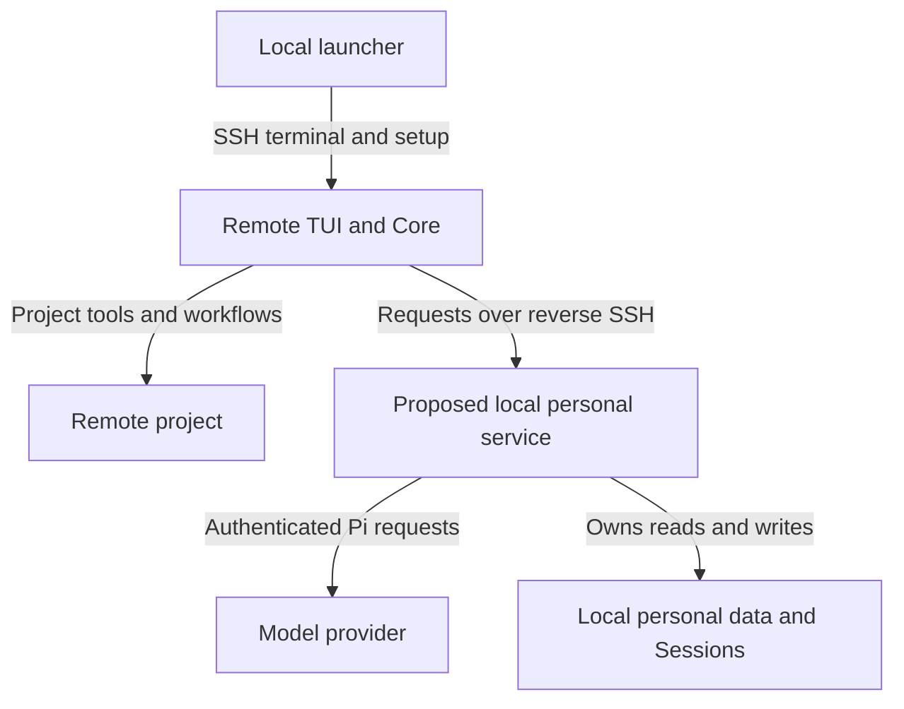
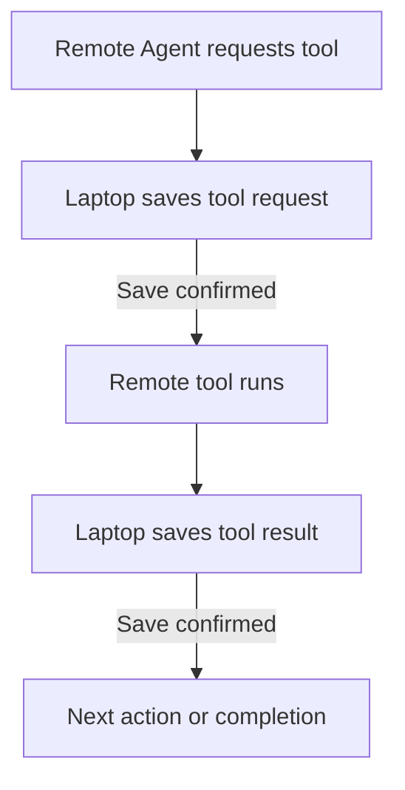
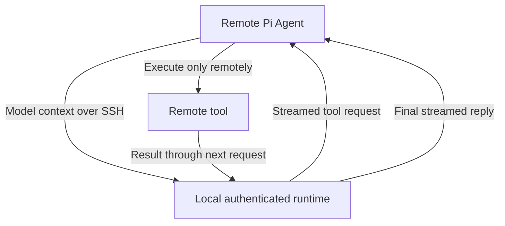

# Remote SSH Development — Early Epic Draft

## Context

**Continuity draft only. Not approved, complete, or ready for decomposition.** No production support or ADR exists. A
throwaway prototype has now proved the narrow Pi model path; it is not proof of a working remote RunWield Session.

**Resume here:** Read this draft, the [PRD](../prd/remote-ssh-prd.md), and the
[feasibility report](../research/remote-ssh-feasibility.md). Use the completed proof below to settle the architecture
before submitting the Epic. Do not repeat the product interview or generalize the Pi result to Session persistence,
review, setup, or disconnect cleanup.

The owner chose a full Epic rather than a limited connection-only Plan. They required the reverse channel proof before
architecture work. That proof passed on 2026-09-20 EDT. The owner also decided that Claude CLI and Antigravity CLI can
be deferred from the first release; they remain future compatibility targets.

### Agreed product requirements

```sh
wld remote sct:~/my-awesome-project
wld remote sct
```

- Use an SSH alias or hostname. Respect existing SSH authentication, host checks, port, user, and jump-host settings.
- Resolve the folder on the remote machine. No folder means the remote user's home. No local checkout or source sync.
- Open the terminal user interface (TUI) remotely. Show the host and folder. Missing folders fail; do not create them or
  silently select another folder. Non-Git locations remain usable where Core already supports them.
- First-release remote hosts are standard Linux on x86-64 (Intel/AMD) and ARM64. Remote macOS and Windows are out of
  scope. This limits the remote host, not the laptop. Exact Linux runtime prerequisites still need verification; do not
  imply support for every distribution, libc, or 32-bit ARM system.
- Prepare compatible RunWield tools automatically on supported hosts. Do not overwrite an existing remote personal
  profile or package-managed installation. Do not install arbitrary project dependencies as part of this promise.
- Use the local personal environment: settings, Agents, skills, prompts, model configuration, credentials, memories, and
  authoritative Session history, including Session attachments.
- Keep project files, project settings/instructions, Git, worktrees, Plans, Work Records, and Project Runtime State
  remote. Remote project overrides retain their normal precedence over personal settings.
- Run all project reads, edits, commands, code search, builds, tests, validation, repair, and publication remotely.
- Open Plan Review and Code Review in the local browser without manual tunnels or a public review server. Browser close
  alone does not cancel a connected Session. “AI review” remains the name for automated Semantic Review.
- Support connected development only. Disconnect stops owned work after loss is detected; no detached Agent continues.
  Preserve remote edits and saved local history. Disconnect is neither publication nor deliberate abandonment.
- Resume saved history against the same remote project without replaying unfinished effects automatically.
- Never copy provider credentials, private SSH keys, the whole local environment, or `~/.wld` to solve compatibility. Do
  not silently change provider, model, or billing method.
- The first release can support only Pi-backed providers. Claude CLI and Antigravity CLI are explicitly deferred by
  owner decision. Their support is not proven by Pi support and must not be advertised.

The reference is [VS Code Remote SSH](https://code.visualstudio.com/docs/remote/ssh): connected work on remote files
with little setup. Its internal design is not a requirement or proof of RunWield feasibility.

**Out of scope:** Unattended work, source synchronization, required local clones, multi-user collaboration, hosted
Workspace registration, remote ACP clients, moving an existing local Session to another checkout, and isolation from a
hostile server. Local ownership does not prevent a trusted server from seeing supplied instructions and memories.

### Product ownership and document status

This is a proposed Core addition. The feature proposal owns the detailed target scenarios:

- [Remote connection and setup](../prd/remote-ssh-prd.md#remote-connection-and-setup)
- [Local personal environment](../prd/remote-ssh-prd.md#local-personal-environment)
- [Local memories and saved Sessions](../prd/remote-ssh-prd.md#local-memories-and-saved-sessions)
- [Remote workflows and local review](../prd/remote-ssh-prd.md#remote-workflows-and-local-review)
- [Disconnect and recovery](../prd/remote-ssh-prd.md#disconnect-and-recovery)

Core remains the lasting owner through its existing capabilities for
[customization](../prd/runwield-core-prd.md#agent-and-skill-customization),
[models](../prd/runwield-core-prd.md#models-and-providers),
[project context](../prd/runwield-core-prd.md#project-context-and-initialization),
[Session continuity](../prd/runwield-core-prd.md#session-continuity),
[Plan review](../prd/runwield-core-prd.md#plan-review), and
[execution, validation, and recovery](../prd/runwield-core-prd.md#execution-validation-and-recovery).

This draft, the PRD, and the feasibility report now record the completed Pi model-path proof. That proof closes the
first feasibility question only. It is not delivery evidence for a complete remote RunWield Session.

## Objective

Enable normal RunWield work on a remote-only project while the laptop remains the authority for personal data.

The proposed division is below. Module names describe responsibilities, not approved classes, protocols, or file layout.
The remote TUI and remote project execution are agreed. The local model bridge is proven for Pi, but the production
service boundary, authorization, and full Session integration still need design.



Browser review forwarding is a separate open design question. Do not assume it uses the same connection direction as
model requests just because both use SSH.

### Candidate responsibilities and constraints

| Area                   | Required authority or behavior                                                                                 | Still unresolved                                                                                 |
| ---------------------- | -------------------------------------------------------------------------------------------------------------- | ------------------------------------------------------------------------------------------------ |
| Local launcher         | Establish SSH, prepare the remote runtime, connect the terminal, coordinate shutdown                           | Bootstrap location, platform support, version compatibility, startup recovery                    |
| Remote Core            | Own project operations and existing workflow rules against the remote folder                                   | How it consumes local resources without a copied personal profile                                |
| Local personal service | If adopted, mediate only required personal capabilities; keep credentials and successful personal writes local | Request API, authorization, request lifetime, resource access, concurrency                       |
| Model access           | Laptop makes authenticated Pi requests; remote tools consume responses and return results                      | Full runtime contract, callbacks, cancellation, errors, CLI backends                             |
| Session persistence    | One authoritative local bundle and writer; remote state is not a second saved history                          | Remote event ordering, save acknowledgement, SDK persistence integration, remote project locator |
| Project Memory         | Local Mnemoteca storage with explicit project scope                                                            | Safe mapping of remote projects to existing or new local collections                             |
| Browser review         | Local browser displays actual remote work; decisions reach the correct pending interaction                     | Server placement, forwarding, review authentication and reconnect                                |
| Connection lifetime    | Loss detection stops new work and cancels owned processes, without killing unrelated processes                 | Detection policy, process ownership, cleanup across helpers and CLI backends                     |

Local save success must mean local persistence, not a promise to sync on exit. Do not expose a general laptop filesystem
or shell service simply to make remote paths work. Exact access controls remain undesigned.

### Session mount alternative — under investigation

The owner proposed mounting the laptop's Session directory into the remote runtime instead of adding explicit network
save calls. A bind mount alone cannot cross machines. SSHFS can present laptop files as a remote Linux filesystem; its
documented passive mode can carry SFTP through a laptop-initiated SSH connection without supplying laptop login
credentials to the remote host. The remote runtime could then retain synchronous Pi file writes.

This alternative deserves evaluation before committing to the explicit-save design below. It replaces application
persistence integration work with a filesystem dependency, not with cost-free local filesystem semantics. Linux FUSE
support and user mount permission become core prerequisites. Blocked filesystem calls on link loss, reopen behavior
after reconnect, cache policy, file sync, atomic replacement, and laptop-versus-mounted-writer coordination all require
proof. Existing `tryLockSync` calls must not be assumed to coordinate across the mount with a laptop-native writer.
Keeping the writer lock on the laptop may still be necessary.

Use only the relevant Session storage area, not the entire personal profile or unrelated Sessions. SFTP's initial
directory is not by itself an access restriction; constrain the exported filesystem separately. Remote project paths
still need explicit identity handling, and mounts do not solve the local model or Memory boundaries.

**Research evidence:** The [SSHFS manual](https://github.com/libfuse/sshfs/blob/master/sshfs.rst) documents passive
reverse mounting, synchronous-write and direct-I/O options, hangs after link loss, and invalid open handles after
reconnect. The [project README](https://github.com/libfuse/sshfs#readme) describes broad Linux distribution availability
but limited maintainer capacity.

**Live mount preflight on `sct`:** SSH with strict host checking succeeded. The host reports Linux x86-64; `/dev/fuse`
is readable and writable, and `fusermount3`, `flock`, `timeout`, and `python3` are available. `sshfs` was not found on
the noninteractive command path. The laptop has `/usr/libexec/sftp-server` and Python; `socat` and `dpipe` were not
found. This preflight made no installation or mount attempt. The later proof below tested actual mount permission and
file behavior without exporting real personal Session files.

### Completed mount proof

At the owner's request, a delegated implementation session built and ran the ignored throwaway harness at
`prototypes/remote-ssh-session-mount-proof/`. Final run: 2026-09-20 01:16–01:17 America/New_York. Evidence is retained
in that directory's `NOTES.md` and `evidence/20260920-011625/results.json`. It used synthetic files only, macOS/Deno
2.9.4 on the laptop, Fedora Linux x86-64 with SSHFS 3.7.3/FUSE 3.16.1 remotely. SSHFS was extracted into a temporary
directory, not installed system-wide. Private pipes connected local OpenSSH SFTP to SSHFS passive mode, with synchronous
writes, direct I/O, and caches disabled. No TCP listener or credential forwarding was used.

| Question                                              | Observed result                                                                                                                                                                         |
| ----------------------------------------------------- | --------------------------------------------------------------------------------------------------------------------------------------------------------------------------------------- |
| Can remote ordinary writes reach laptop storage?      | Yes. Appends and bidirectional updates matched exact bytes.                                                                                                                             |
| Can Pi keep its file API?                             | Pi 0.85.1 SessionManager appended messages, metadata, and custom entries; a fresh mount reopened and appended to the same laptop JSONL.                                                 |
| Do file sync and atomic replacement work?             | Ten replacement cycles completed; SFTP logs showed file fsync and POSIX rename. No partial JSON in 53 samples. This is bounded evidence, not a crash/power-loss guarantee.              |
| Does directory sync reach the laptop?                 | Not demonstrated. The call returned success, but this SSHFS version has no directory-fsync callback or matching server request.                                                         |
| Do laptop and remote writers exclude each other?      | No. Both acquired the same backing lock in both test directions. Laptop used actual Deno locking; Linux used native Python flock. Two writers on the same mount did exclude each other. |
| Does a stalled service settle through SSH keepalives? | No within the observed eight seconds: paused SFTP blocked writes even while SSH remained alive. Resuming the service completed the write.                                               |
| What happens when transport is killed?                | A pending write failed with EIO and subsequent operations failed; the worker settled about 10 ms after kill. Previously saved laptop bytes remained intact.                             |
| Can new writes fall back to remote disk?              | Yes. After SSHFS removed the mount, a delayed create succeeded in the underlying remote directory and was absent on the laptop.                                                         |
| Can a fresh connection reuse the files?               | Yes. Remount reopened saved history and Pi appended another entry, verified on the laptop.                                                                                              |

All proof mounts, remote package/scratch directories, and tracked processes were removed, including resources from an
earlier harness cleanup failure. Local synthetic files and evidence remain only under the ignored prototype root. No
real personal Session directory was mounted. The SFTP path audit found only scratch requests, but export confinement was
not established. Pi's tested calls ran on Node 20 despite its declared Node >=22.19 requirement; this is not a
supported-runtime claim. No ARM64 run, true network partition, full RunWield Session, or whole-Agent cleanup was tested.

**Architectural conclusion:** A mount can preserve synchronous Pi file access, but is not a drop-in preservation of
RunWield's Session guarantees. A mount-based design still needs laptop-owned writer coordination, prevention of writes
beneath a lost mount, bounded handling of storage-service stalls, and explicit durable-save behavior. Those controls
remain undesigned and unproven; the failures do not establish that a guarded mount is impossible. Compare their cost and
Linux prerequisites with the explicit-save design below before adoption.

**Decision pending:** Choose guarded mount-backed storage or explicit save boundaries using the completed proof. Neither
storage approach has owner approval yet. A mount must pass the same save/loss/resume requirements; do not waive them
because normal file reads work.

### Proposed locking for mount-backed storage — awaiting owner review

Do not use flock through SSHFS as cross-machine authority. A laptop-side Session owner acquires the existing native
Session Writer Lock on behalf of the remote managed operation. Local TUI, ACP, and Workspace continue using that same
lock file. Competing writers therefore meet on one operating system, not on separate mount-local locks.

Writable access to the exported Session files is permitted only while that operation owns the laptop lock. The remote
runtime requests ownership through the control connection; it cannot grant itself authority by locking a mounted file.
At settlement the owner stops accepting writes from that operation, completes or fails outstanding file requests,
commits required local evidence, then releases the lock. Idle open terminals do not retain writer ownership.

Crash ordering is essential: the lock must remain held for as long as any SFTP-serving process can still write for the
old operation. A launcher holding the lock while an independent SFTP child can outlive it is insufficient. The service
lifetime and native lock ownership must be coupled. A stale connection or file handle must not regain write access when
a later operation acquires the lock. Do not reuse an unrestricted persistent SFTP writer across ownership changes. Exact
coupling to the selected SFTP implementation still needs design and a bounded proof; no custom SFTP server is selected
merely by this recommendation.

**Evidence required:** A remote managed operation blocks a laptop-native writer and another remote operation. Normal
settlement permits the next writer. Killing the launcher or storage-serving process cannot leave an old writable mount
while a successor owns the lock. Delayed writes from the old connection cannot change the successor's history. Test
these against the actual serving processes, not only a helper that holds a lock.

This keeps existing operation-scoped OS locking and adds cross-machine ownership requests; it does not introduce
heartbeats, lock expiry, or forced takeover. It solves writer exclusion only. Lost-mount fallback, stalled file
requests, and remote project effects still need their own controls and verification.

### Proposed Session save design — awaiting owner review

Keep the authoritative bundle and operation-scoped OS writer lock on the laptop. The remote Pi SessionManager holds
entries in memory, loaded from verified laptop history. It must not create a second saved remote transcript. Remote
project/workflow state remains remote; local transcript storage does not become Plan or publication authority.

RunWield's Session persistence module owns an ordered, acknowledged transfer of exact Pi entries to the local bundle.
Its interface binds requests to the current connection, Session, segment, and managed operation. Each write identifies
its expected predecessor and request sequence. An identical retried save returns its existing result; a conflicting or
stale save cannot change history. Preserve Pi entry IDs, parent links, timestamps, and compaction references rather than
recreating entries with different IDs on the laptop. Acknowledgement means the laptop completed the required durable
write, not that the remote process queued a save.



Input and attachments must be saved before their model request. Tool requests must be saved before tool execution;
results must be saved before dependent work or saved-success reports. These are logical save boundaries, not a network
round trip for every text delta. Text remains live while streaming. Final managed-operation settlement drains pending
writes, publishes the locally computed generation evidence, and releases the existing writer lock before reporting
completion. A remote reported digest is not local commit evidence.

The installed Pi Agent's awaited listeners can help enforce conversation ordering. They are not sufficient alone:
non-Agent mutations, configuration changes, compaction, accepted workflow records, and segment rollover also need
awaited save boundaries. Early Session events are display activity, not save acknowledgements. A storage failure remains
an operation failure even if a caller catches the exception; it must block further dependent effects and false success.
The implementation must demonstrate coverage rather than claim that a single event subscriber captures everything.

On loss, stop further work and preserve laptop evidence. If an effect completed remotely but its result was not saved,
reconnect must inspect actual project/workflow state; do not replay the effect. If only a save acknowledgement was lost,
consult saved evidence before retrying that save. Already acknowledged history must not disappear merely because the
operation's final generation was not published. Recovery must distinguish durable transcript entries from uncertain
external effects. No distributed filesystem transaction or exactly-once external execution is promised.

**Recommendation and cost:** Use explicit awaited save boundaries with Pi's in-memory manager. This costs network and
disk latency at action boundaries, plus careful integration coverage, but avoids maintaining a Pi fork or blocking the
remote event loop on every synchronous append. A separate blocking helper could preserve Pi's synchronous interface, but
adds failure/cancellation machinery and can stall the terminal. Exit-time copying is rejected because it violates
local-save semantics. The main recommendation remains for owner review, not an accepted dependency change.

**Evidence required:** Cut the link before a request save, after save but before acknowledgement, during a tool, after a
tool effect, and during final publication of Session evidence. Prove no unacknowledged action is started, no dependent
action crosses a failed save, no acknowledged entry is lost, and no uncertain remote effect is automatically replayed.
Include rename, model changes, compaction, attachments, workflow acceptance, and segment rollover; a chat-only test is
insufficient. Verify the remote resource cache and logs do not form a second saved Session history.

### Proposed project and Memory identification

Separate project identity, execution directory, and personal Memory selection. Resolve remote paths and Git worktree
relationships on the remote host. A remote project locator identifies the host and canonical primary project path;
execution retains the current checkout/worktree directory. Never run laptop `stat`, `realPath`, or directory creation
against that locator. Local Session bundle paths are derived separately and remain subject to local containment checks.
Existing local project IDs, Session directories, and Memory names remain unchanged.

Keep the SSH connection recipe separate from the project's saved identity. Matching effective SSH host/user/port and
verified host evidence can reuse a known host record after an alias rename. Do not equate hosts by alias spelling or
host-key fingerprint alone. Uncertain host equivalence needs confirmation rather than automatic history merging. Exact
host-record matching remains technical design work.

Store a local mapping from remote project ID to personal Memory collection. New unrelated projects get distinct
collections. The existing PRD permits deliberate reuse of an existing collection by name, without its local checkout;
ask once when mapping is ambiguous and remember the answer. Sharing Memory never combines Session identities. Core
Memory injection, explicit tools, and `/sleep` must all use this same mapping; cwd basenames must not choose a different
scope. Work Record indexes remain separate and must hydrate canonical documents from the correct remote project.

**Evidence required:** Same-name projects on different hosts remain distinct; worktree execution retains its project;
known alias changes reconnect correctly; intentional collection reuse affects Memory only; saved history remains
readable offline. Do not migrate existing local collection names to claim remote correctness.

### Alternatives and corrections

- **Plain `ssh host wld` or profile copying:** Does not meet local personal ownership, existing local sign-in, or local
  history. Rejected as the complete solution.
- **Run everything locally and forward project tools:** Could reduce changes to personal storage, but conflicts with the
  agreed remote TUI and touches many project operations. Not selected. Revisit only with the owner if the proof shows
  that the proposed division is not practical.
- **One `streamSimple` replacement supports all providers:** Incorrect. Pi needs more runtime functions, and the CLI
  backends bypass this path. Do not reuse this earlier claim.
- **31 personal modules versus 127 filesystem modules means four times less work:** An earlier conversation used these
  counts. They are not a verified effort estimate or sufficient architectural evidence. Coupling and lifecycle matter
  more than import counts.

No new library, datastore, permanent daemon, protocol, or lease system has been selected. Favor existing SSH and Pi
capabilities, but assess their maintenance and upgrade costs before committing.

## Vertical Slice Findings

### Current Session creation and provider boundaries

Source inspection traced:

```text
buildExecutionSession
  backend pi -> buildAgentSession
    createRunWieldModelRuntime -> local credential/model configuration
    createAgentSession -> ModelRuntime.streamSimple -> provider
    Agent loop -> project tool -> next model request
  backend claude-cli -> ClaudeCliExecutionSession -> claude process
  backend agy-cli -> AgyCliExecutionSession -> agy process
```

Evidence: `src/shared/session/session.js`, `src/shared/models/model-registry.ts`, and the backend directories.
`buildAgentSession` combines settings, prompt resources, extensions, tools, model runtime, and persistence around one
`cwd`. Passing a remote path or changing `HOME` does not split these responsibilities safely.

The installed Pi coding-agent package reported version **0.85.1** during inspection. Relevant installed sources are
`node_modules/@earendil-works/pi-coding-agent/dist/core/sdk.js`, `dist/core/agent-session.js`, and
`node_modules/@earendil-works/pi-agent-core/dist/agent-loop.js` and `dist/proxy.js`. Recheck against the installed
version on restart; these are dependency internals, not a stable RunWield API promise.

- `ModelRuntime.streamSimple` returns an `AssistantMessageEventStream`. Callers use async iteration and `.result()`.
  Terminal `done` or `error` events must settle the result; premature stream termination must not hang.
- Model selection and Session behavior also use runtime methods such as `getModel`, `getAvailableSnapshot`,
  `hasConfiguredAuth`, `checkAuth`, `getAuth`, and `isUsingOAuth`. Provider registration and summarization need
  attention. A local-only credential requirement must also cover these paths, not only the first model request.
- SDK hooks include request, response, and header callbacks. Functions and abort signals are not directly transferable
  as JSON. Their placement and semantics need an explicit design.
- Pi's existing `streamProxy` client POSTs to `/api/stream` and reads server-sent events. It reconstructs partial text
  and tool calls and handles premature close as an error. No matching server or ready reverse-SSH proof was found.
- That proxy forwards only a subset of request options. Inspection found omitted callbacks, timeout/retry-count options,
  `toolChoice`, and deferred options; its event representation does not preserve all current response fields. It is a
  reuse candidate, not an accepted drop-in solution.
- Cancelling its fetch does not establish that the local service cancels the provider request.
- The Pi SSH extension example forwards tools from a local Agent. It does not prove the requested
  remote-Agent/local-model arrangement.
- OpenAI Codex through Pi is an OAuth provider path, not a separate Codex CLI backend. Current backends are `pi`,
  `claude-cli`, and `agy-cli`. Claude and agy use their own sign-in and native project tools in the subprocess
  directory.

### Personal data, persistence, and review

- `getSettingsDir` and merged settings in `src/shared/settings.js` use global `~/.wld` plus project `.wld` settings.
  Project values win; linked worktrees resolve primary-checkout settings.
- Skills and prompt resources can contain local absolute paths or scripts. Portability cannot be inferred from copying
  their text. MCP configuration is separate; servers can require local credentials or remote files.
- `resolveProjectCollectionName` in `src/extensions/mnemoteca/tools.ts` uses a primary-repository directory basename,
  with a cwd basename fallback. Names can collide or split one project across clones. Explicit recall is not the only
  path: Core Memory injection in `session.js` and `/sleep` also need correct scope.
- Recall combines project and global memories with project precedence. Writes default to project scope. Global writes
  remain deliberate. Work Record retrieval must read canonical records from the remote project.
- Team Memory rules still apply: no committed Mnemoteca database/index; accepted reviewable text is canonical, with
  derived Team records activated from Trusted Branch state. Remote personal access must not bypass that trust boundary.
- [ADR-015](../adr/015-file-authoritative-session-bundles.md) owns local transcript bundles, atomic manifests, recovery
  descriptors, and operation-scoped OS writer locks. Do not introduce a competing remote history or timeout takeover.
- `root-session.js` and `file-session-store.ts` currently assume local project paths. Remote project identity must
  distinguish remote targets without requiring those folders to exist locally. Host/alias canonicalization is open.
- `live-session-connection.ts` is a temporary same-user, same-machine socket, not an existing cross-host protocol.
- Review servers bind to loopback. Remote loopback is not laptop loopback. Browser decisions must reach the same live
  interaction; a historical Session association does not grant permission to act on a workflow.
- `foreground-process.ts` can terminate process trees. This alone does not prove cleanup on SSH loss; helpers, MCP, and
  CLI subprocesses need coverage.

### Session save and identity findings

`root-session.js:createRootSessionManager` constructs a disk-backed Pi manager. `installDenoSessionPersistence`
intercepts synchronous `_persist` and `_rewriteFile` calls. Ordinary transcript writes bypass `file-session-store`; that
store owns manifests, generations, artifacts, and locking. Replacing its interface alone does not move history.

Pi 0.85.1 `SessionManager` append methods return synchronously and update in-memory state before persistence. Turning
`_persist` into an async function would not cause its callers to wait. Pi AgentSession also emits Session events before
appending message entries, and those subscriber promises are not awaited. In contrast, Agent-core `processEvents` awaits
listeners in order. This supports awaited save boundaries, but metadata, compaction, workflow records, and other
non-Agent changes still need separate coverage. `task-completion-session.ts:recordAcceptedTaskCompletion` is one
important synchronous append-before-acceptance path.

`session-runtime.js:#runManagedOperation` acquires the writer, hydrates the current transcript, runs the operation,
syncs evidence, and publishes a generation before release. Preserve this ownership with storage on the laptop.
`segment-rollover.ts` currently performs filesystem operations that also must remain under laptop authority.

`file-session-storage.ts:ensureProject` requires a local directory; `root-session.js` locators and
`session-resume-list.ts` also derive identity from local paths. Remote locations need an explicit distinct
representation, not fake laptop folders. Project identity and a segment's execution cwd are already separate concepts.

Memory currently has inconsistent selectors: explicit tools use a Git-aware basename, Core injection invokes Mnemoteca
without an explicit collection, and `/sleep` uses a cwd basename. Remote support must supply a single resolved local
collection to all three, rather than reproduce these implicit filesystem assumptions. Work Record indexing has its own
basename-derived collection and must remain tied to canonical remote records.

### Personal resource portability findings

A follow-up source trace found two skill-loading paths: RunWield's `listSkills` in `session.js` and Pi's
`DefaultResourceLoader`. The latter still discovers skills when automatic extensions, context files, and prompts are
disabled. Both paths must use the intended personal resource source; adapting one catalog is insufficient.

`named-invocation.ts:expandSkillResource` resolves sibling resources relative to the skill directory. Skills can direct
ordinary file reads and shell commands. Transferring instruction text alone does not supply those files, interpreters,
or Linux-compatible binaries. Installed package resources and extensions have the same compatibility concern.

`mcp/config.ts:resolveMcpConfig` merges personal and project server definitions, with project overrides and disable
rules. `mcp/pool.ts:startMcpToolPool` starts stdio subprocesses in the Session directory. A personal server can depend
on laptop credentials or files; starting the same definition remotely is not equivalent. Keeping it local preserves
those dependencies but does not give it remote project files. Generic tool arguments cannot safely be rewritten as
remote paths.

**Agreed skill behavior:** Copy the complete personal skill trees, including scripts and supporting files, to a separate
remote resource area. Do not select only files predicted to work or require per-skill compatibility approval. Local
originals remain authoritative; remote copies do not replace or merge into an existing remote personal profile. Preserve
relative resource paths and project override rules across both skill-loading paths.

RunWield must supply and verify its own core capabilities on supported Linux hosts. User skills and third-party
integrations are best effort: required CLIs, platform-specific scripts, hard-coded paths, and other custom dependencies
are the user's responsibility. RunWield does not promise to classify arbitrary skills for portability, install every
custom dependency, or repair those integrations. Actual failures must remain visible; a custom skill failure must not
prevent connection or unrelated core work. No fallback executes project commands on the laptop.

Skills are treated as user-authored shareable resources, not credential storage. Copy their full contents as requested;
do not claim automatic secret detection or filtering. This permission does not extend to provider credential stores, SSH
keys, the laptop environment, or the whole personal profile. Product documentation must state the full-copy and
best-effort behavior. Credential-bearing MCP configuration remains a separate design question; this decision does not
approve copying its secrets.

**Evidence required:** A skill with nested files reaches the remote host intact and resolves its relative resources. A
skill whose CLI is absent remains available and reports its execution failure, while core tools still work. Core
capability tests must not be waived under the third-party best-effort policy. The implementation that delivers this
behavior must update the owning PRD's personal-environment scenarios.

### Live Pi model-path evidence

**Observed on 2026-09-20 EDT, using the existing `sct` SSH alias:**

- A throwaway prototype under ignored `prototypes/remote-ssh-model-proof/` installed Pi Agent Core 0.85.1 in a temporary
  remote directory. The laptop ran `createRunWieldModelRuntime` with local `openai-codex/gpt-5.6-luna` authentication
  and exposed only a one-run bearer-protected stream endpoint through reverse SSH.
- The remote Pi `Agent` used `streamProxy`. It requested `read_remote_sentinel`, executed that tool remotely, sent the
  result through a second local model request, and streamed the exact sentinel in its final reply. A different laptop
  file at the identical path was unchanged.
- Text deltas arrived before completion. For both model requests, proxy `.result()` content and usage matched the final
  Agent message. The first request ended with `toolUse`; the second ended with `stop`.
- Calling the remote Agent's abort reached the laptop endpoint and aborted the local provider stream. The remote result,
  local terminal event, and Agent state all settled as `aborted`.
- Killing only the reverse tunnel made the remote Agent settle with
  `Connection closed by proxy server before the
  response completed`; the laptop provider stream settled as `aborted`.
  A fresh SSH connection then completed another remote tool round trip.
- The remote shell exposed no provider-key environment variable and had no RunWield or Pi auth file at the checked
  standard paths. The remote Agent had no direct provider stream function or fallback. Temporary files were removed on
  both machines.

**Proven:** A real Pi Agent can run remotely while authenticated model requests run locally, with streamed tool loops,
matching terminal results, cancellation propagation, tunnel-loss settlement, machine-correct tools, and a fresh
connection after loss.

**Still not proven:** Production authorization, full RunWield Session integration, personal resources and persistence,
browser review, bootstrap/version policy, process cleanup beyond the active model call, or durable Session resume.
Claude CLI and Antigravity CLI are deferred and unproven. The prototype uses Pi's existing proxy representation, whose
known option and event omissions still require production design.

### Earlier reverse-channel transport evidence

**Observed on 2026-09-19 EDT, using the existing `sct` SSH alias:**

- Noninteractive SSH with strict host checking succeeded. Remote OS reported Linux. Remote `curl`, `node`, `python3`,
  `ss`, and `timeout` were on the tested command path. `deno` and `wld` were not found on that noninteractive path; this
  does not establish that they are absent from all login environments.
- A temporary laptop `nc` listener served dummy HTTP data on local loopback.
- `ssh -R 127.0.0.1:<remote-port>:127.0.0.1:<local-port>` created the return path, with `ExitOnForwardFailure=yes`.
- Remote `ss` showed the listener bound to `127.0.0.1`, not a public address.
- Remote `curl` received `first` and then `second` as separate chunks about 4.5 seconds apart. The request reached the
  local listener. The remote endpoint was unavailable before the tunnel opened and after SSH closed normally.
- The local listener was cleaned up. No credentials or project contents were sent. Nothing was installed remotely.

**Proven:** This host permits loopback reverse SSH forwarding and live HTTP streaming from laptop to remote caller.

**Not proven:** Real model calls, Pi Agent integration, remote tool loops, credential refresh, cancellation of upstream
requests, abrupt network-loss cleanup, local Session persistence, or CLI support. Normal SSH exit is not a simulated
network partition. No automated tests or live provider requests were run for this proof.

## Expected Change Surface

These are evidence-based areas, not an approved implementation checklist or a complete change list.

- `src/cli.ts`, `src/cmd/registry.js` — new remote entry point; no such command was found during discovery.
- `src/shared/settings.js` and resource loading in `src/shared/session/session.js` — separate personal and project
  ownership while preserving override rules and Agent behavior.
- `src/shared/models/model-registry.ts` and `src/shared/session/backends/` — local model authority and explicit backend
  compatibility. Remote model metadata must not expose provider secrets embedded in configuration or headers.
- `src/shared/session/root-session.js`, `file-session-store.ts`, and related Session machinery — remote project locators
  with local authoritative history and existing writer guarantees.
- `src/extensions/mnemoteca/tools.ts`, Core injection, and `src/cmd/sleep/index.ts` — local memory operations with one
  consistent remote-project mapping. No silent migration of current local collection names.
- `src/shared/mcp/`, helper execution, and foreground processes — correct execution location and owned-process cleanup.
- `src/shared/workflow/` — preserve remote project authority, worktree behavior, validation, recovery, and publication.
- `src/ui/review/` and `src/ui/workspace/server.js` — local-browser access to remote reviews. No Workspace lifecycle
  redesign or new browser design system is implied.
- PRD and domain-language documents — same-change updates only when behavior becomes real. Existing terminology remains
  current truth; “Remote SSH connection” is proposed language, not a new durable Session type.

## Reuse Opportunities

- OpenSSH configuration, authentication, strict host checking, terminal allocation, and forwarding. Do not invent a
  separate SSH credential store or bypass host verification.
- `createRunWieldModelRuntime` and `RunWieldCredentialStore` — existing local provider auth/configuration authority.
- Pi's Agent tool loop and stream types; `streamProxy` only after testing its option/event limitations.
- Existing Core project tools and workflows on the remote host, rather than a parallel reduced workflow implementation.
- ADR-015 Session bundles, committed evidence, writer locking, and recovery. Reuse contracts without assuming current
  local-path implementations already work across machines.
- Existing review servers and foreground-process management, once forwarding and loss behavior are proven.

## Verification Plan

### Completed proof used for architectural convergence

The throwaway implementation exercised the real installed Pi path, not only `curl` or fabricated model events:



The 2026-09-20 run showed:

- A real provider request uses local authentication. The remote process has no provider credentials and cannot silently
  fall back to direct provider access.
- Text arrives before completion. Final events and `.result()` agree, including usage and tool-call content.
- A tool operates on a remote-only sentinel resource; a distinct local resource is untouched. Its result reaches a
  second model request and affects the reply. No local checkout is required.
- User cancellation stops the local upstream request. Tunnel loss settles the remote call without hanging or continuing
  autonomous tool work. Check both ends; a closed fetch alone is insufficient evidence.
- A new connection completed a fresh request. This is not durable Session resume, which still needs separate
  verification.
- Failures and omissions are recorded honestly. The owner deferred Claude/agy; this Pi proof does not establish their
  future compatibility.

The run used a trusted host, synthetic prompts/files, and a locally configured model. It did not transmit project
contents or credentials or mutate personal settings or Session history. The ignored prototype and full local evidence
remain under `prototypes/remote-ssh-model-proof/` for the current checkout.

### Later verification expectations

These commands are future checks, not claims of current success:

- `deno task doc-links:check` for tracked documentation.
- `deno task seams:check` and `deno task ci` as implementation evolves.
- Use `deno task test` or `deno run -A scripts/run-tests.js <test arguments>` for automated tests, never direct
  `deno test`. Use sandboxed HOME and memory storage. Do not add injection seams for owned workflow or storage rules.
- Run the complete PRD journey on a remote-only project: setup, plan, local browser review, remote execution,
  validation, AI review, Code Review where selected, confirmed publication, disconnect, and saved continuation.
- Distinguish normal exit, explicit Stop, laptop process death, network loss, remote process failure, and browser close.
  Verify no unrelated process is killed and uncertain external actions are not repeated blindly.

### Outcome Evidence

| Proposed outcome              | Observable evidence                                                                                                                                                 | Owning proposal scenarios                                     |
| ----------------------------- | ------------------------------------------------------------------------------------------------------------------------------------------------------------------- | ------------------------------------------------------------- |
| Correct remote setup          | Both command forms open the intended remote directory; absent folder fails; existing remote profile and install remain unchanged                                    | Remote connection and setup                                   |
| Local personal authority      | A personal setting/memory save is visible locally before disconnect; project settings change only remotely; credentials and renewal remain local                    | Local personal environment; Local memories and saved Sessions |
| Real remote execution         | All project tools and the full delivery journey act on remote-only files, with distinct local files unchanged                                                       | Remote workflows and local review                             |
| Correct project scope         | Two unrelated same-name folders cannot share history or memories accidentally; deliberate memory mapping survives reconnect                                         | Local memories and saved Sessions                             |
| Local authoritative history   | Saved conversation stays readable locally after loss; remote Session resume restores saved Agent/model/context without replay; no competing remote personal history | Local memories and saved Sessions                             |
| Usable local review           | Laptop browser shows actual remote Plan/diff; feedback reaches the live Session; browser close alone leaves the connected wait intact                               | Remote workflows and local review                             |
| Connected-only work           | On detected loss, owned Agent/tool processes stop without a final client message; unrelated processes survive; uncertain effects are reconciled                     | Disconnect and recovery                                       |
| Honest provider compatibility | Each advertised backend passes its own real remote-tool/local-auth journey; unsupported paths fail before the turn without substitution                             | Local personal environment                                    |

**Protected behavior:** Ordinary local TUI/ACP/Workspace use, settings precedence, Agent/model selection, Session writer
rules, private transcripts, Memory scopes, trusted Team Memory activation, Plan approval, validation/AI review/Code
Review, worktree protection, and confirmed publication. Workspace browser disconnect behavior stays unchanged.

**Behavior to remove from the new remote path:** Dependence on a separate remote personal setup, exit-only personal
sync, accidental laptop project operations, wrong-folder fallback, and continued autonomous work after detected loss.
These are target prohibitions, not claims that a remote implementation already exists. No ordinary local capability is
selected for removal.

Eventual child outcomes must update their owning Core requirements and scenarios with the behavior they deliver. The
cross-capability remote-only delivery and reconnect journeys need combined evidence; a set of passing isolated tests is
not enough. Fold lasting requirements into Core and retire the transient PRD only after preserving delivered and unmet
scope and fixing references. Update the glossary in the implementation change that makes each proposed relationship
true. Actual decomposition remains for Slicer after approval, not this draft.

## Edge Cases & Considerations

### Decisions and evidence still needed

1. **Full RunWield integration:** The Pi model boundary is proven. A full Session still needs local personal resources,
   persistence, workflow integration, and remote project identity without weakening stream or cancellation semantics.
2. **Deferred CLI compatibility:** Claude/agy are outside the first release. Future support must inspect native tools,
   MCP, subprocesses, temporary resources, CLI-owned history, and local sign-in. A browser SSH login is not local-only
   auth.
3. **Personal-service permissions:** Which operations may the remote process request? How are they tied to one
   connection, project, and active operation? A loopback listener can still be reached by other users on a shared host;
   SSH encryption alone is not application authorization.
4. **Session persistence:** How will remote Session machinery obtain locally committed save evidence while preserving
   one local writer? Local history and remote side effects cannot form one atomic filesystem transaction.
5. **Remote project identity and Memory:** Handle alias changes, canonical remote paths, symlinks/worktrees, same-name
   projects, and intentional sharing. Ask once when existing memory mapping is ambiguous; do not infer it from basename.
6. **Resources and integrations:** Full personal skill-tree copying and best-effort custom dependency support are
   agreed. Define the remaining handling of MCP, environment references, custom endpoints, attachments, and local
   `localhost` URLs without copying credential stores. Do not pretend every local executable is portable.
7. **Bootstrap and compatibility:** Remote Linux x86-64 and ARM64 are agreed; remote macOS and Windows are excluded.
   Exact Linux prerequisites, install permissions, required helper versions, partial setup, cache location, and behavior
   when the laptop and remote runtime versions differ remain open.
8. **Review and shutdown:** Prove local-browser forwarding plus the difference between browser close and SSH loss.
   Choose a measurable loss-detection policy and verify cleanup across every supported backend; no latency target has
   been agreed.

### Failure, migration, and maintenance constraints

- Network loss is not instantly detectable. Cancelling processes cannot undo remote edits, already accepted external
  requests, or completed publication. Output never received locally is not saved history.
- Connection-loss detection is not a Session writer lease. ADR-015 rejects time-based takeover; preserve that
  distinction.
- Reconnect must not merge a stale remote personal profile over newer local data or repeat uncertain publication.
- Remote project credentials, including Git publication access, remain real prerequisites. Connecting does not silently
  grant access to laptop Git credentials.
- Existing local Sessions and memory names must keep working. There is no approved global migration or remote profile
  import. Bootstrap/runtime removal must not delete the user's project or personal data.
- A trusted server sees data supplied to it. Do not promise forensic deletion of all temporary bytes or secrecy from
  that server. Keep credentials out of logs, model metadata, protocol errors, and copied configuration.
- Over the next six to twelve months, Pi API changes, provider event formats, CLI releases, platform binaries, and
  paired runtime compatibility are the main maintenance risks. Version negotiation and compatibility policy need design;
  do not adopt an incomplete proxy unchanged merely because it already exists.
- No sibling-product dependency is required by the current scope. Workspace and ACP behavior must stay compatible; their
  presence must not become a prerequisite for this command.

**Next conversation starting point:** The narrow Pi model path is proven. Remote Linux x86-64 and ARM64 are agreed;
remote macOS/Windows and Claude/agy are out of first-release scope. Full personal skill-tree copying is agreed; custom
skills and third-party dependencies are best effort, while RunWield core must work. Resolve remaining integration
handling, Session persistence, project identity, review forwarding, and connection lifetime. This document remains a
checkpoint, not an approved architecture or an implementation plan.
